# Cognito Auth Flow - REST Runbook - Console

## Purpose

Build the Cognito Auth Flow REST API deployment in the AWS Console, then validate MFA authentication, token helper scripts, and protected Jedi/Sith routes.

### Details

Deployment details:

- Cognito User Pool and app clients for managed login, token helper scripts, and optional `SECRET_HASH` validation
- Chewbacca test user with software-token MFA
- Jedi Python Lambda and Sith Node.js Lambda route handlers
- API Gateway REST API resources, methods, Lambda proxy integrations, and `prod` stage
- REST API Cognito User Pool authorizer with protected `/prod/jedi` and `/prod/sith` routes
- Managed Login page, access-token route tests, and CloudWatch validation evidence


## Prerequisites

### Dependencies

#### Applications

| Dependency | Requirement |
| --- | --- |
| AWS Console and browser | Create resources visually and complete browser-based login or validation steps. |
| AWS CLI | Create, update, describe, validate, and tear down AWS resources. |
| jq | Parse JSON responses and export generated IDs, tokens, or ARNs. |
| Python 3 | Run helper scripts and package Python-based Lambda code when required. |
| zip | Package Lambda source files for upload. |
| curl | Validate API routes and HTTP responses. |

#### Infrastructure

| Dependency | Requirement |
| --- | --- |
| AWS account and region | Create the REST API deployment in the intended account and region. |
| IAM capability | Create roles, attach policies, and add Lambda invoke permissions. |

#### Access Requirements

| Dependency | Requirement |
| --- | --- |
| AWS credentials | Use credentials with permission to manage IAM, Lambda, API Gateway, Cognito, and CloudWatch. |
| Authenticator app | Generate valid TOTP codes when enrolling and testing software-token MFA. |

#### APIs And Services

| Dependency | Requirement |
| --- | --- |
| Amazon Cognito | User Pool, app clients, software-token MFA, managed login, and auth challenge flows. |
| AWS Lambda | Jedi Python and Sith Node.js route handlers. |
| API Gateway REST API | Resources, methods, Lambda proxy integrations, stage deployment, and Cognito User Pool authorizer. |
| IAM | Execution roles and Lambda permissions. |
| CloudWatch Logs | Evidence for direct Lambda invocation and authorized route execution. |

### Supporting Files

| File | Use |
| --- | --- |
| [`../env.example`](../env.example) | Deployment value template copied to `.env` before building. |
| [`../architecture.md`](../architecture.md) | REST request flow and Cognito authorization boundary. |
| [`../README.md`](../README.md) | REST deployment overview and document map. |
| [`RUNBOOK-CLI.md`](RUNBOOK-CLI.md) | Companion runbook for the same deployment path. |
| [`TEARDOWN_REST.md`](TEARDOWN_REST.md) | Teardown runbook for resources created by this deployment. |
| [`../../shared/lambda-code/`](../../shared/lambda-code/) | Shared Jedi and Sith Lambda handlers. |
| [`../../shared/scripts/`](../../shared/scripts/) | Secret hash and token helper scripts used for authentication and route validation. |
| [`../../requirements.txt`](../../requirements.txt) | Python dependencies for token helper scripts. |
| [`../../assets/images/`](../../assets/images/) | Screenshots used as visual validation examples where applicable. |

### Authentication and Authorization Flow

```text
User initiates authentication with Amazon Cognito
        ↓
Cognito validates credentials and required MFA challenges
        ↓
Cognito issues JWT tokens
        ↓
Client sends an API request with an access token
        ↓
API Gateway validates the JWT signature, claims, and required scope
        ↓
Authorized requests are routed to the appropriate Lambda function
        ↓
Unauthorized requests are rejected by API Gateway
        ↓
CloudWatch logs and metrics provide visibility into request processing
```

This flow uses:

- Chewbacca test user
- Cognito User Pool
- default public app client for token helper scripts
- additional secret-bearing CLI app client for `SECRET_HASH`
- `USER_AUTH` and `SELECT_CHALLENGE`
- `PASSWORD`
- `SOFTWARE_TOKEN_MFA`
- access token with `aws.cognito.signin.user.admin` scope
- API Gateway REST API Cognito User Pool authorizer
- protected `/prod/jedi` and `/prod/sith` Lambda routes

> [!IMPORTANT]
> REST methods are protected with an authorization scope. Once `aws.cognito.signin.user.admin` is configured on the API methods, use the Cognito **access token** for protected route tests. Do not use the ID token for the scoped route test.

### Environment Checks

Confirm AWS identity:

```bash
aws sts get-caller-identity
```

Set the repo root before running packaging, helper scripts, or validation commands:

```bash
export REPO_ROOT="<COGNITO_CLI_AUTH_FLOW_REPO_ROOT>"
cd "$REPO_ROOT"
```
---

# Preparation

## 1. Create And Load The Environment File

An environment file helps simplify deployment and provides a record of planned values and resource outputs. You will copy the dotenv template, rename the copy to `.env`, update initial values, then reload it before running commands that depend on those values.

Copy the template:

```bash
cp "$REPO_ROOT/REST/env.example" \
  "$REPO_ROOT/REST/.env"
```

Set the environment file path:

```bash
export ENV_FILE="$REPO_ROOT/REST/.env"
```

Get the AWS account ID:

```bash
aws sts get-caller-identity --query Account --output text
```

Open `.env` in VS Code or your editor of choice:

```bash
code "$ENV_FILE"
```

In `.env`, update the foundational inputs and review the planned values before building:

```bash
REPO_ROOT="/Users/kirk/devsecops/cognito-cli-auth-flow"
AWS_ACCOUNT_ID="123456789012"
AWS_REGION="us-east-1"
PROJECT_NAME="chewbacca-auth-rest"
TEST_USERNAME="chewbacca"
TEST_EMAIL="chewbacca@example.com"
TEST_PASSWORD="Wookiee#2026!"
TEMP_PASSWORD="Wookiee#TEMP1!"
```

Save `.env`, then load it for the build phase:

```bash
set -a
source "$ENV_FILE"
set +a
```

Validate the starting values before building:

```bash
echo "AWS_REGION=$AWS_REGION"
echo "AWS_ACCOUNT_ID=$AWS_ACCOUNT_ID"
echo "PROJECT_NAME=$PROJECT_NAME"
echo "JEDI_FUNCTION=$JEDI_FUNCTION"
echo "SITH_FUNCTION=$SITH_FUNCTION"
echo "API_NAME=$API_NAME"
echo "USER_POOL_NAME=$USER_POOL_NAME"
echo "AUTHORIZER_NAME=$AUTHORIZER_NAME"
```

> [!NOTE]
> Keep stable infrastructure values in `.env`. Keep short-lived values like `SESSION`, `TOTP_CODE`, `SECRET_HASH`, `ACCESS_TOKEN`, `ID_TOKEN`, `REFRESH_TOKEN`, and full auth responses in the terminal only.


---

# Lambda Foundation

## 2. Create Lambda Execution Roles

This build uses separate Lambda execution roles for the Python Jedi function and the Node Sith function.

### Steps

Create the Python Lambda role first.

1. Open **IAM**.
2. Click **Roles**.
3. Click **Create role**.
4. Choose trusted entity type **AWS service**.
5. Choose use case **Lambda**.
6. Click **Next**.

7. Search for `AWSLambdaBasicExecutionRole`.
8. Select the `AWSLambdaBasicExecutionRole` policy.
9. Click **Next**.

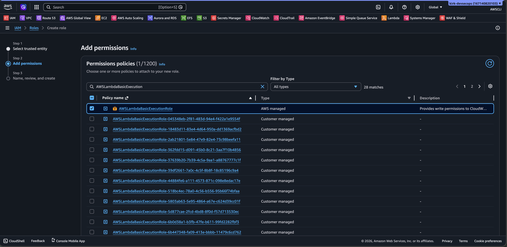

10. Set the role name to `chewbacca-auth-rest-lambda-python-role`.


11. Review the permissions summary.


12. Click **Create role**.
13. Repeat the same steps for the Node role and name it `chewbacca-auth-rest-lambda-node-role`.
14. Give IAM a few seconds to propagate before creating Lambda functions.

## 3. Package Lambda Code

Package the shared Lambda handlers with the default filenames expected by the Lambda console handlers.

```bash
cd "$REPO_ROOT/shared/lambda-code"

cp jedi_python.py lambda_function.py
zip jedi-python.zip lambda_function.py

cp sith_node.js index.js
zip sith-node.zip index.js
```

Validation:

```bash
ls -lh jedi-python.zip sith-node.zip
```

Packaging confirmation:


## 4. Create The Lambda Functions

Create both Lambda functions in the console first, then use the CLI reference if you want to build the same resources from exported values.

### 4.1 Jedi Python Lambda

#### Steps

| Setting | Value |
| --- | --- |
| Function name | `chewbacca-auth-rest-jedi-python` |
| Runtime | Python 3.12 |
| Execution role | `chewbacca-auth-rest-lambda-python-role` |
| Handler | `lambda_function.lambda_handler` |
| ZIP file | `shared/lambda-code/jedi-python.zip` |

1. Open **Lambda**.
2. Click **Create function**.
3. Select **Author from scratch**.
4. Set **Function name** to `chewbacca-auth-rest-jedi-python`.
5. Set **Runtime** to **Python 3.12**.
6. Under permissions, choose **Use an existing role**.
7. Select `chewbacca-auth-rest-lambda-python-role`.
8. Click **Create function**.


9. On the function page, open the **Code** tab.
10. Click **Upload from**.
11. Select **.zip file**.

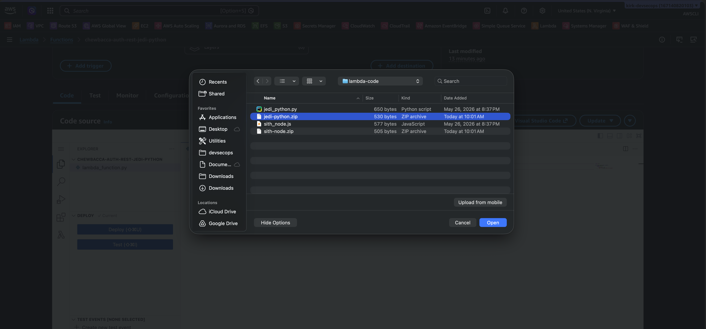

12. Select `shared/lambda-code/jedi-python.zip`.
13. Click **Save**.

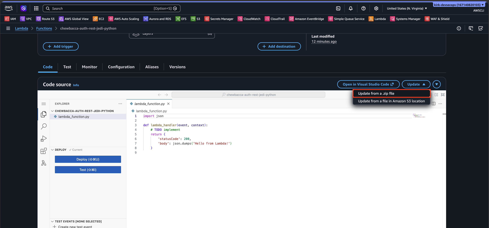

14. Confirm Lambda reports a successful code update.

If the editor still has the old default `lambda_function.py` tab open, Lambda may show a success message and a file-not-found editor error at the same time.


15. Close the stale editor tab.
16. Open the uploaded `lambda_function.py`.

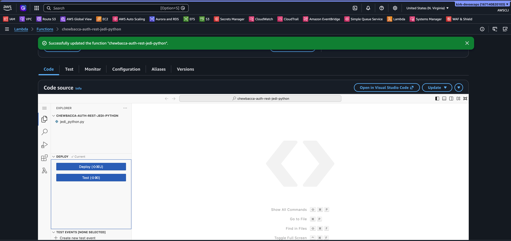

17. If the stale tab is still visible, click the new file or close the old tab to clear the editor error.

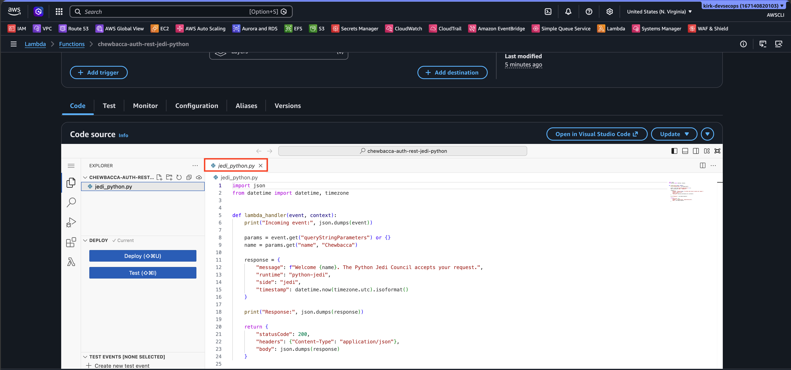

18. If you uploaded `jedi_python.py` directly instead of the prepared ZIP, right-click `jedi_python.py`.

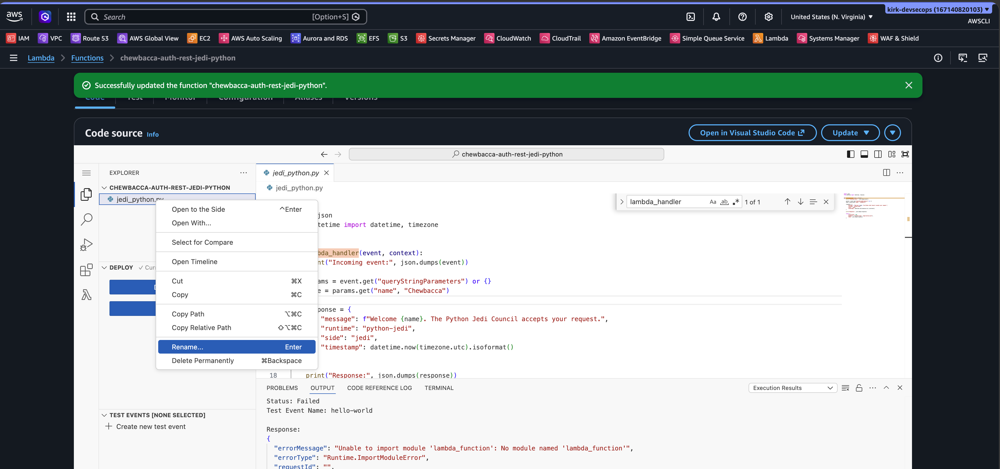

19. Rename it to `lambda_function.py`.
20. Confirm the handler remains `lambda_function.lambda_handler`.

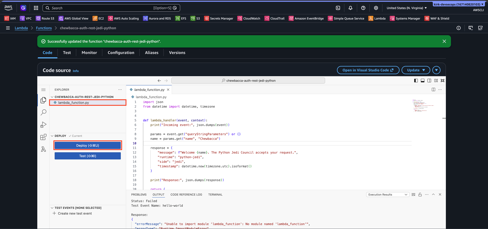

### 4.2 Sith Node Lambda

#### Steps

| Setting | Value |
| --- | --- |
| Function name | `chewbacca-auth-rest-sith-node` |
| Runtime | Node.js 20.x |
| Execution role | `chewbacca-auth-rest-lambda-node-role` |
| Handler | `index.handler` |
| ZIP file | `shared/lambda-code/sith-node.zip` |

1. Return to **Lambda**.
2. Click **Create function**.
3. Select **Author from scratch**.
4. Set **Function name** to `chewbacca-auth-rest-sith-node`.
5. Set **Runtime** to **Node.js 20.x**.
6. Under permissions, choose **Use an existing role**.
7. Select `chewbacca-auth-rest-lambda-node-role`.
8. Click **Create function**.


9. Open the **Code** tab.
10. Click **Upload from**.
11. Select **.zip file**.
12. Select `shared/lambda-code/sith-node.zip`.
13. Click **Save**.
14. If you uploaded `sith_node.js` directly instead of the prepared ZIP, rename it to `index.js`.
15. Confirm the handler remains `index.handler`.


> [!WARNING]
> Lambda handler names must match both the file name and exported function name. Python uses `lambda_function.lambda_handler`. Node uses `index.handler`. A mismatched handler causes runtime import errors even when the uploaded code is correct.

### 4.3 Confirm Lambda Permissions And Export ARNs

#### Steps

If the console created an automatic execution role, switch each function to the matching role from this runbook.

1. Open the Lambda function.
2. Click **Configuration**.
3. Click **Permissions**.

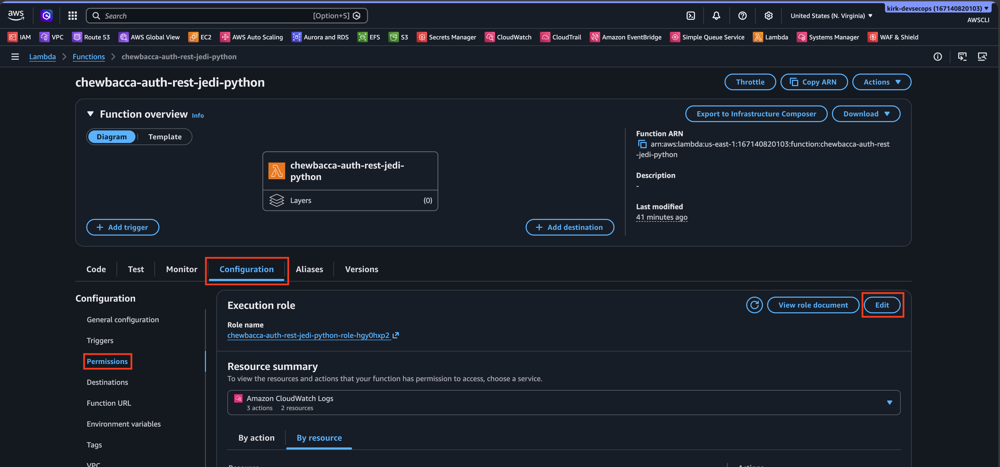

4. Click **Edit** in the execution role section.

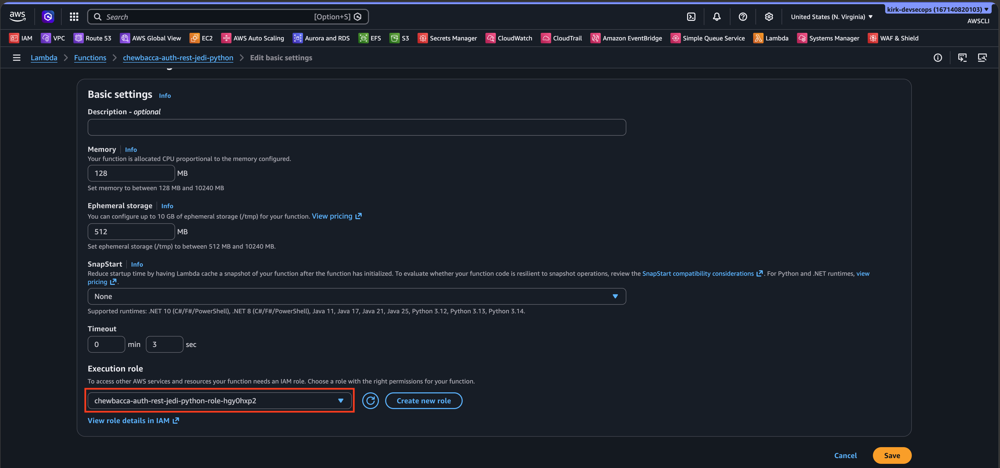

5. Select the matching role.

| Function | Execution role |
| --- | --- |
| Jedi Python | `chewbacca-auth-rest-lambda-python-role` |
| Sith Node | `chewbacca-auth-rest-lambda-node-role` |


6. Click **Save**.

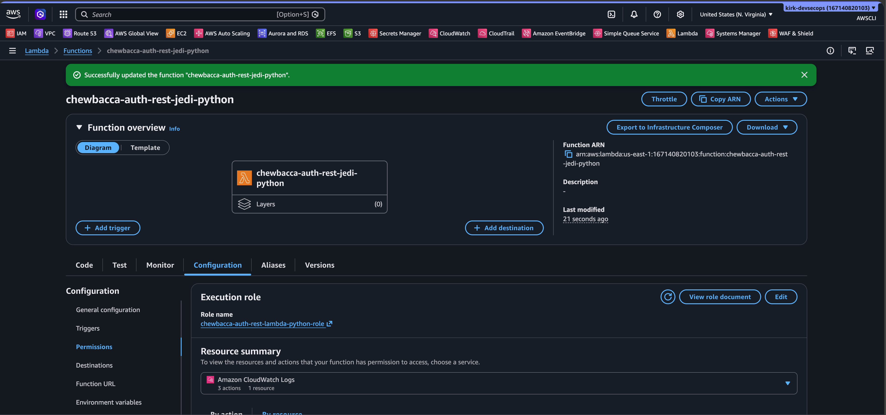

7. Choose **Deploy** after code or configuration changes.
8. Repeat for the Sith Node function.

After creating the functions, export the function ARNs. This is part of the clickops workflow too: copy the function ARNs from the Lambda overview page, or use the CLI commands below.

```bash
export JEDI_FUNCTION_ARN=$(aws lambda get-function \
  --function-name "$JEDI_FUNCTION" \
  --query 'Configuration.FunctionArn' \
  --output text \
  --region "$AWS_REGION")

export SITH_FUNCTION_ARN=$(aws lambda get-function \
  --function-name "$SITH_FUNCTION" \
  --query 'Configuration.FunctionArn' \
  --output text \
  --region "$AWS_REGION")

echo "$JEDI_FUNCTION_ARN"
echo "$SITH_FUNCTION_ARN"
```

Function ARN export validation:


## 5. Test Lambda Directly

Invoke the Python Lambda:

```bash
aws lambda invoke \
  --function-name "$JEDI_FUNCTION" \
  --payload '{"queryStringParameters":{"name":"Chewbacca"}}' \
  --cli-binary-format raw-in-base64-out \
  /tmp/chewbacca-rest-jedi-response.json \
  --region "$AWS_REGION"

jq . /tmp/chewbacca-rest-jedi-response.json
```

Expected:

```text
Jedi route returns 200 and a Python Jedi Council message.
```

Jedi Python direct test:


Jedi Python invoke success:

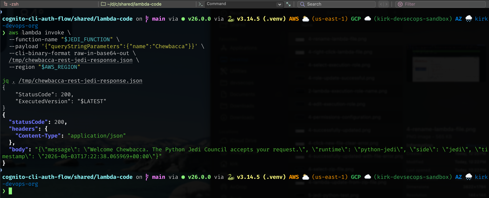

Invoke the Node Lambda:

```bash
aws lambda invoke \
  --function-name "$SITH_FUNCTION" \
  --payload '{"queryStringParameters":{"name":"Chewbacca"}}' \
  --cli-binary-format raw-in-base64-out \
  /tmp/chewbacca-rest-sith-response.json \
  --region "$AWS_REGION"

jq . /tmp/chewbacca-rest-sith-response.json
```

Expected:

```text
Sith route returns 200 and a Node Sith message.
```

Sith Node invoke success:


---

# API Gateway Baseline

## 6. Create The REST API And Resources

### Steps

| Setting | Value |
| --- | --- |
| API name | `chewbacca-auth-rest-api` |
| Endpoint type | Regional |

1. Open **API Gateway**.
2. Click **Create API**.
3. Find **REST API** and click **Build**.
4. Choose **New API**.
5. Set **API name** to `chewbacca-auth-rest-api`.
6. Set **Endpoint type** to **Regional**.
7. Click **Create API**.

Create the REST resources after the API exists.

| Resource | Parent path | Console location | Value |
| --- | --- | --- | --- |
| Jedi resource | `/` | API Gateway resources | `jedi` |
| Sith resource | `/` | API Gateway resources | `sith` |

8. Open the REST API **Resources** view.
9. Select the root `/` resource.
10. Click **Create resource**.


11. Leave **Resource path** as `/`.
12. Set **Resource name** to `jedi`.
13. Click **Create resource**.


14. Confirm the `/jedi` resource appears.

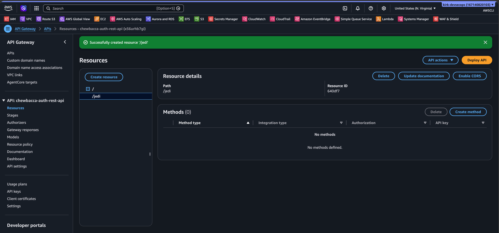

15. Select the root `/` resource again.
16. Click **Create resource**.
17. Leave **Resource path** as `/`.
18. Set **Resource name** to `sith`.
19. Click **Create resource**.

20. Copy the root `/`, `/jedi`, and `/sith` resource IDs from API Gateway.
21. Export those resource IDs so the later validation and method setup commands can use them:

```bash
export ROOT_RESOURCE_ID="<ROOT_RESOURCE_ID_FROM_CONSOLE>"
export JEDI_RESOURCE_ID="<JEDI_RESOURCE_ID_FROM_CONSOLE>"
export SITH_RESOURCE_ID="<SITH_RESOURCE_ID_FROM_CONSOLE>"
```

22. Open **API settings** and copy the API ID.
23. Export the API ID and endpoint:

```bash
export REST_API_ID="<REST_API_ID_FROM_CONSOLE>"
export API_ENDPOINT="https://${REST_API_ID}.execute-api.${AWS_REGION}.amazonaws.com"
```

24. Validate the clickops exports:

```bash
echo "$REST_API_ID"
echo "$ROOT_RESOURCE_ID"
echo "$JEDI_RESOURCE_ID"
echo "$SITH_RESOURCE_ID"
echo "$API_ENDPOINT"
```

The output should print the values in this order:

```text
<REST_API_ID_FROM_CONSOLE>
<ROOT_RESOURCE_ID_FROM_CONSOLE>
<JEDI_RESOURCE_ID_FROM_CONSOLE>
<SITH_RESOURCE_ID_FROM_CONSOLE>
https://<REST_API_ID_FROM_CONSOLE>.execute-api.<AWS_REGION>.amazonaws.com
```

## 7. Add REST Methods And Lambda Proxy Integrations

Create public `GET` methods before adding Cognito. This proves routing works before authorization.

### Steps

1. Click the `/jedi` resource.
2. Click **Create method**.


3. Method type: `GET`.
4. Integration type: Lambda function.
5. Turn on **Lambda proxy integration**.
6. Response transfer mode: `Buffered`.
7. Lambda function: select `chewbacca-auth-rest-jedi-python` or paste `$JEDI_FUNCTION_ARN`.

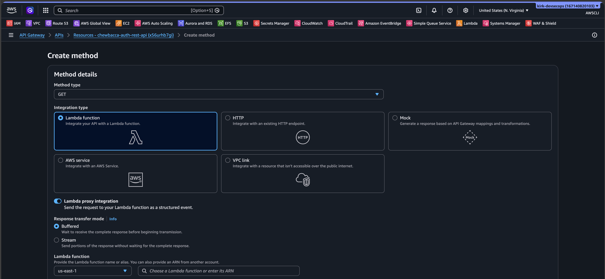

8. Confirm Lambda integration is selected.


9. Click **Create method**.

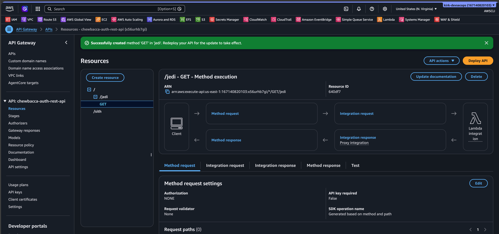

10. Repeat the same method setup for `/sith`.
11. Select `chewbacca-auth-rest-sith-node` for the Sith Lambda integration.
12. Confirm both resources have `GET` methods.

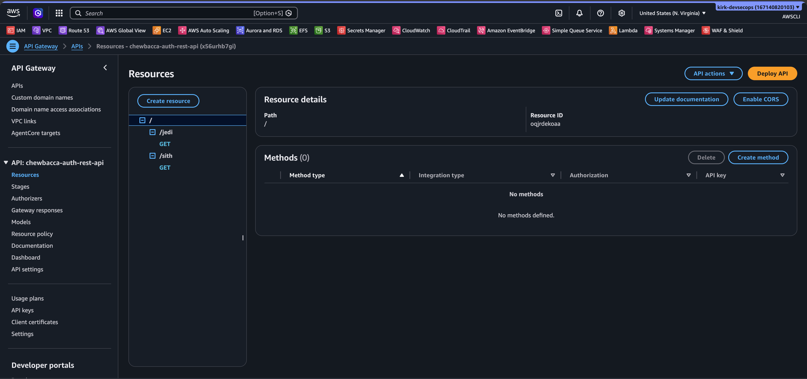

13. Click **Deploy API**.

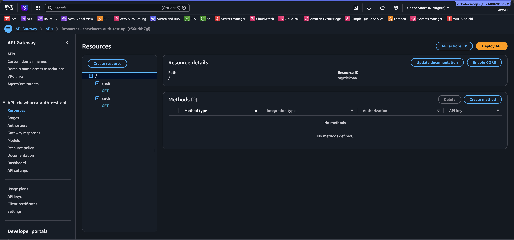

14. Choose **New stage**.


15. Set **Stage name** to `prod`.

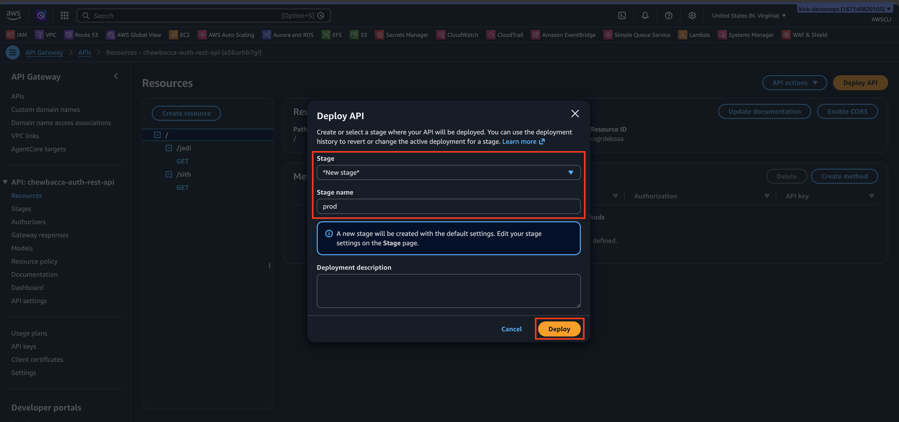

16. Add deployment description `Public Jedi and Sith baseline before Cognito authorizer`.
17. Click **Deploy**.

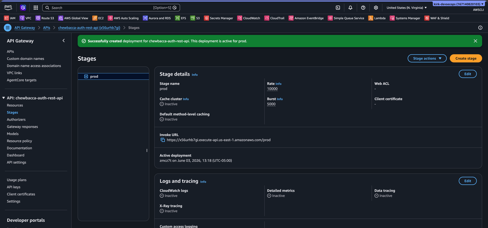

18. Open **API settings**.
19. Confirm the same API ID you exported in Section 6.


## 8. Test Unprotected REST Paths Without A Token

These tests should work before the authorizer is attached.

Test the Python route:

```bash
curl -i "${API_ENDPOINT}/prod/jedi?name=Chewbacca"
```

Test the Node route:

```bash
curl -i "${API_ENDPOINT}/prod/sith?name=Chewbacca"
```

Expected:

```text
HTTP/2 200
```

Jedi route test before the authorizer:

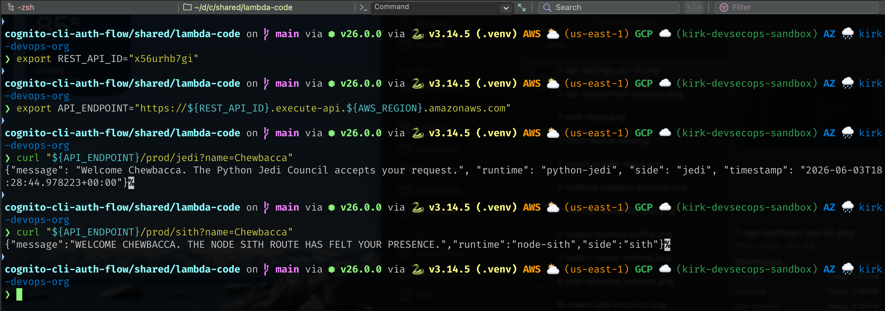

Both unprotected route tests:

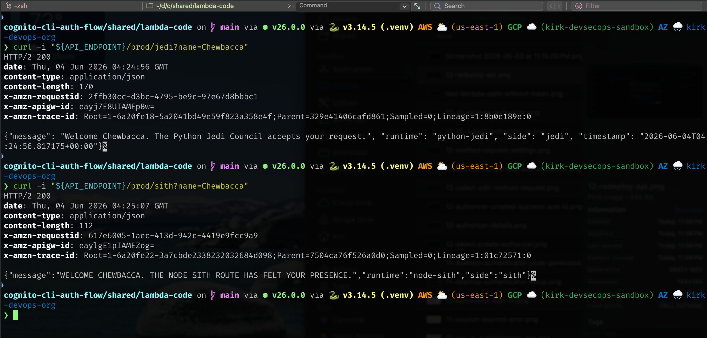

Validation:

- API Gateway reaches both Lambda functions.
- CloudWatch logs show Lambda proxy event payloads.
- If either request fails now, fix routing before adding Cognito.


---

# Cognito Identity Configuration

## 9. Create The Cognito User Pool

### Steps

1. Open **Amazon Cognito**.
2. Click **User pools**.
3. Click **Create user pool**.


4. For **Application type**, select **Single page application**.

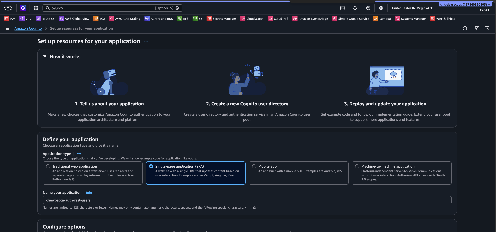

5. Set **User pool name** to `chewbacca-auth-rest-users`.
6. Under sign-in identifiers, select **Email** and **Username**.
7. Under required sign-up attributes, select **Birthdate**, **Email**, **Name**, and **Phone number**.
8. Continue through the remaining configuration screens.

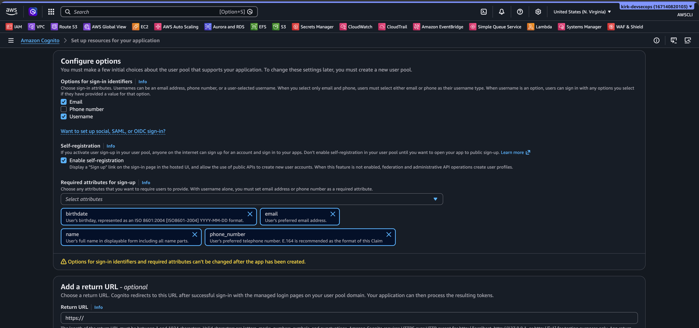

9. Click **Create user pool**.

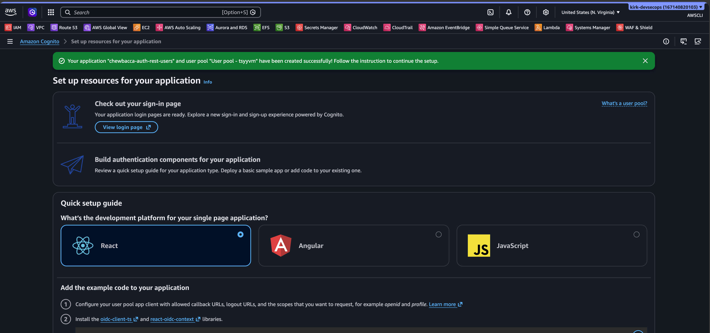

10. If Cognito generated a default name, open the user pool **Overview** page.
11. Click **Rename**.


12. Replace the default name with `chewbacca-auth-rest-users`.

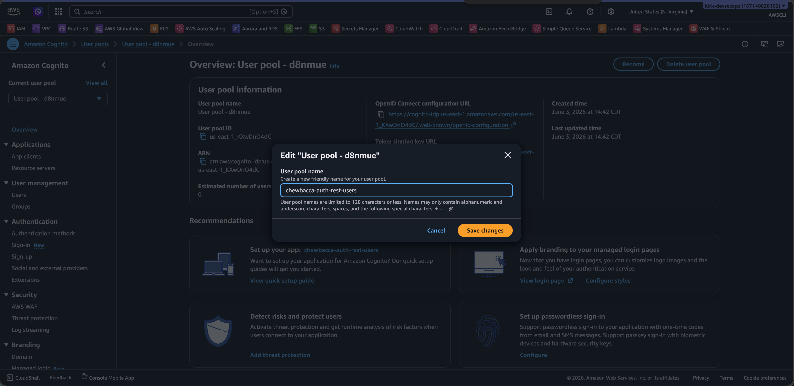

13. Save the rename.

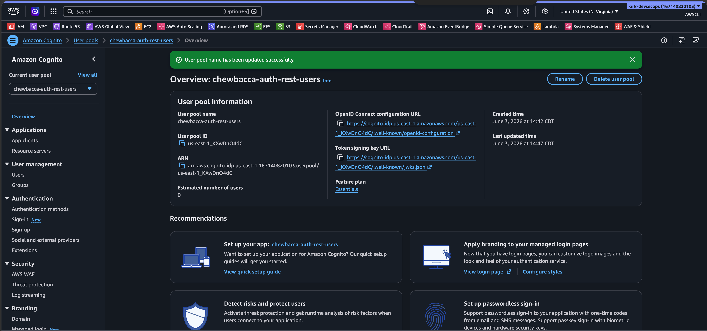

14. On the user pool overview page, copy the user pool ID.

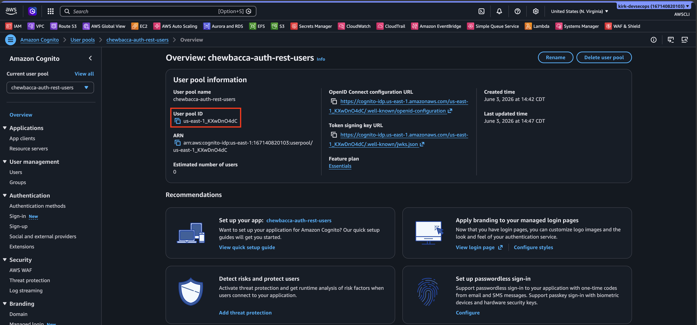

15. Export the user pool ID for the remaining commands:

```bash
export USER_POOL_ID="<USER_POOL_ID_FROM_CONSOLE>"
```

16. Export the issuer and user pool ARN:

```bash
export COGNITO_ISSUER="https://cognito-idp.${AWS_REGION}.amazonaws.com/${USER_POOL_ID}"
export USER_POOL_ARN="arn:aws:cognito-idp:${AWS_REGION}:${AWS_ACCOUNT_ID}:userpool/${USER_POOL_ID}"

echo "$USER_POOL_ID"
echo "$COGNITO_ISSUER"
echo "$USER_POOL_ARN"
```


## 10. Enable Software Token MFA

### Steps

1. Open the user pool.
2. Click **Authentication**.
3. Click **Sign-in**.
4. In the **Multi-factor authentication** tile, click **Edit**.


5. Under **MFA authentication**, choose **Require MFA - Recommended**.
6. Under MFA methods, select **Authenticator apps**.
7. Click **Save**.


## 11. Configure App Clients

This runbook uses one required no-secret app client and supports one optional secret-bearing app client:

| Client | Secret | Purpose |
| --- | --- | --- |
| Default `chewbacca-auth-rest-users` client | No secret | Managed login and token helper scripts |
| Optional `chewbacca-auth-rest-cli-client` client | Secret | `SECRET_HASH` validation flow |

### 11.1 Edit The Default No-Secret App Client

#### Steps

1. In the user pool, click **Applications**.
2. Click **App clients**.
3. Click the default `chewbacca-auth-rest-users` app client.
4. In the **App client information** tile, click **Edit**.


5. Enable these authentication flows:

- Choice-based sign-in: `ALLOW_USER_AUTH`
- Sign in with username and password: `ALLOW_USER_PASSWORD_AUTH`
- Sign in with secure remote password: `ALLOW_USER_SRP_AUTH`
- Get new user tokens from existing authenticated sessions: `ALLOW_REFRESH_TOKEN_AUTH`

6. Set these token values:

| Token setting | Value |
| --- | --- |
| Authentication flow session duration | 15 minutes |
| Access token expiration | 60 minutes |
| ID token expiration | 60 minutes |
| Refresh token expiration | 1 day |


7. Click **Save changes**.

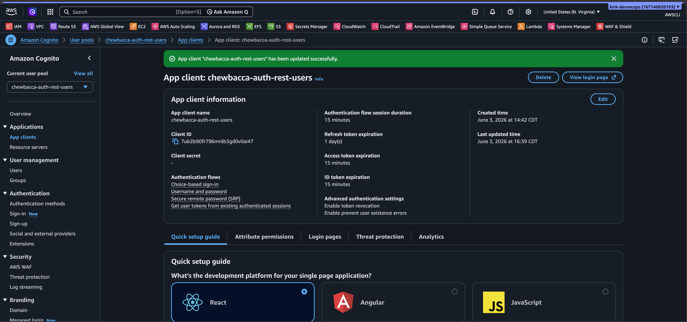

8. Copy the default no-secret app client ID and export it:

```bash
export COGNITO_PUBLIC_CLIENT_ID="<DEFAULT_NO_SECRET_CLIENT_ID>"
```

### 11.2 Create The Additional Secret-Bearing CLI App Client

> [!IMPORTANT]
> This step is optional: Only create a secret-bearing app client if you need to validate `SECRET_HASH` flows.

Create this app client only when you need to validate `SECRET_HASH` flows.

#### Steps

1. In the user pool, click **Applications**.
2. Click **App clients**.
3. Click **Create app client**.

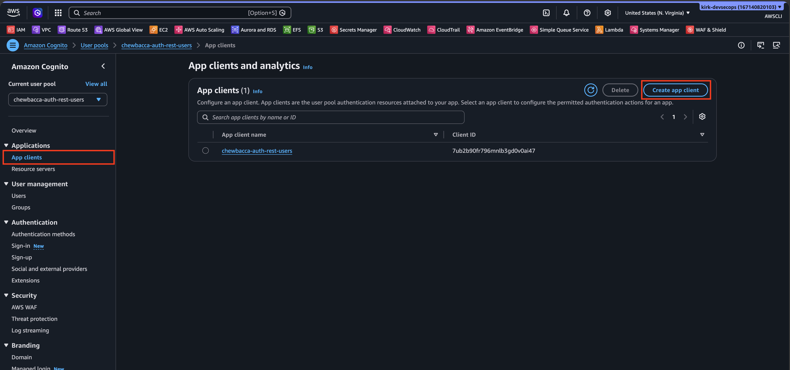

4. In **Define your application**, set these values:

| Setting | Value |
| --- | --- |
| Application type | Traditional web application |
| App client name | `chewbacca-auth-rest-cli-client` |
| Client secret | Generate client secret |
| Authentication flow session duration | 15 minutes |
| Access token expiration | 60 minutes |
| ID token expiration | 60 minutes |
| Refresh token expiration | 1 day |

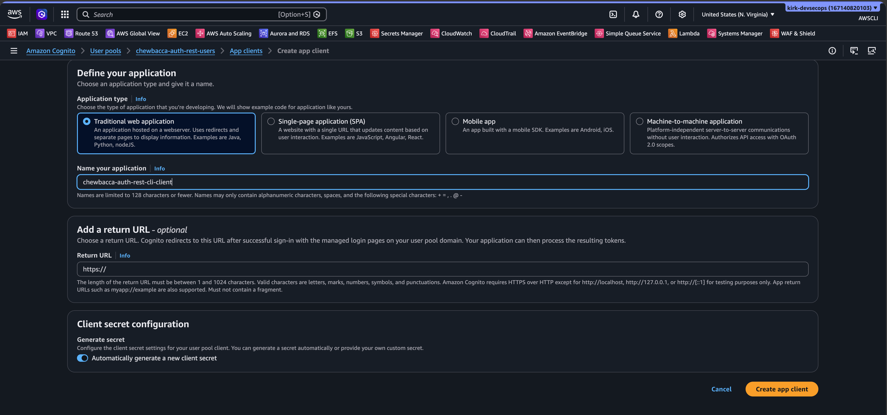

5. Click **Create app client**.


6. Open the new `chewbacca-auth-rest-cli-client` app client.
7. In the **App client information** tile, click **Edit**.


8. Enable these authentication flows:

- Choice-based sign-in: `ALLOW_USER_AUTH`
- Sign in with username and password: `ALLOW_USER_PASSWORD_AUTH`
- Sign in with secure remote password: `ALLOW_USER_SRP_AUTH`
- Get new user tokens from existing authenticated sessions: `ALLOW_REFRESH_TOKEN_AUTH`


9. Confirm the token duration values remain:

| Token setting | Value |
| --- | --- |
| Authentication flow session duration | 15 minutes |
| Access token expiration | 60 minutes |
| ID token expiration | 60 minutes |
| Refresh token expiration | 1 day |

10. Click **Save changes**.

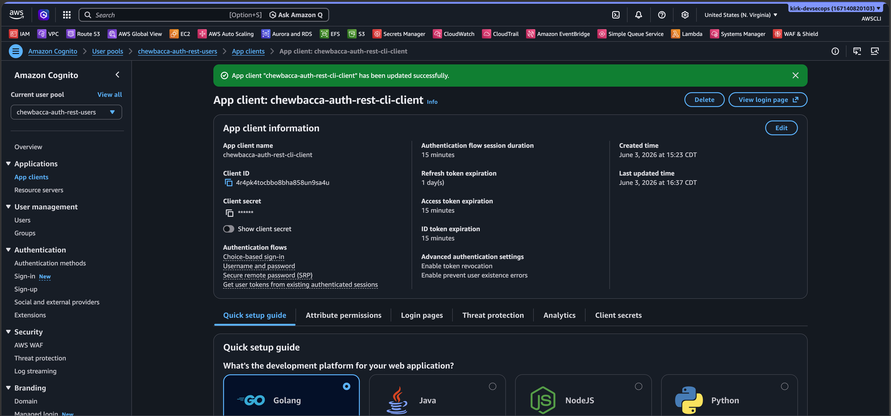

11. On the app client page, copy the client ID.

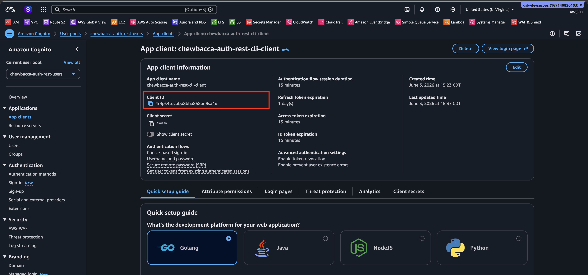

12. Export it:

```bash
export CLIENT_ID="<CLI_SECRET_CLIENT_ID>"
```

13. Click **Show client secret**.
14. Copy the client secret and export it:

```bash
export CLIENT_SECRET="<CLI_CLIENT_SECRET>"
```

15. Describe the app client and validate the exported values:

```bash
export CLIENT_JSON=$(aws cognito-idp describe-user-pool-client \
  --user-pool-id "$USER_POOL_ID" \
  --client-id "$CLIENT_ID" \
  --query 'UserPoolClient' \
  --output json \
  --region "$AWS_REGION")

echo "$CLIENT_ID"
echo "${CLIENT_SECRET:0:8}..."
echo "$CLIENT_JSON" | jq '{ClientName,ExplicitAuthFlows,AuthSessionValidity,AccessTokenValidity,IdTokenValidity,RefreshTokenValidity,TokenValidityUnits}'
```

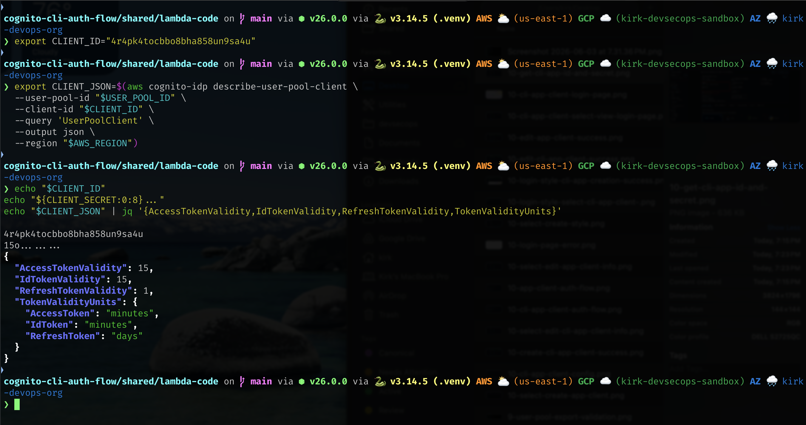

> [!IMPORTANT]
> Do not commit real secrets. The export command stores the full client secret, but the validation command in this runbook only prints a short prefix for validation.

### 11.3 Create Managed Login Styling

#### Steps

1. In the user pool, click **Branding**.
2. Click **Managed login**.
3. Click **Create style** in the styles tile.

> [!NOTE]
> Cognito managed login can show a browser error if a login page style has not been created and assigned. Create the style before using **View login page**.

If you try to view the login page before creating a style, you may see this browser error:


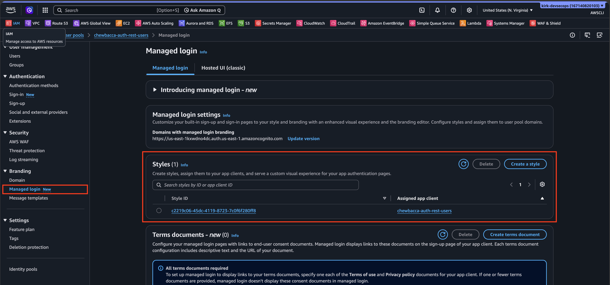

4. Select `chewbacca-auth-rest-cli-client`.

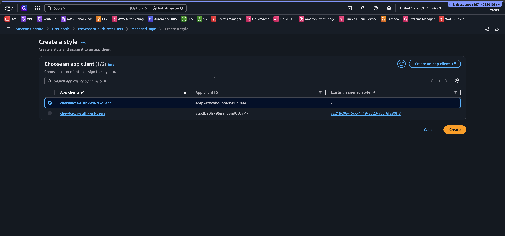

5. Click **Create**.

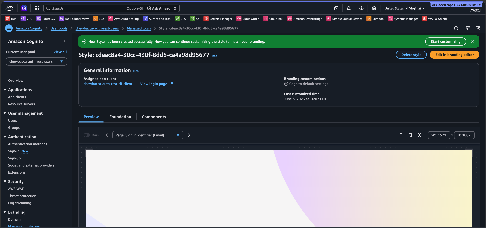

6. Click the **Assigned app client** to return to the app client page.
7. Click **View login page**.


8. Confirm the CLI app client login page opens.

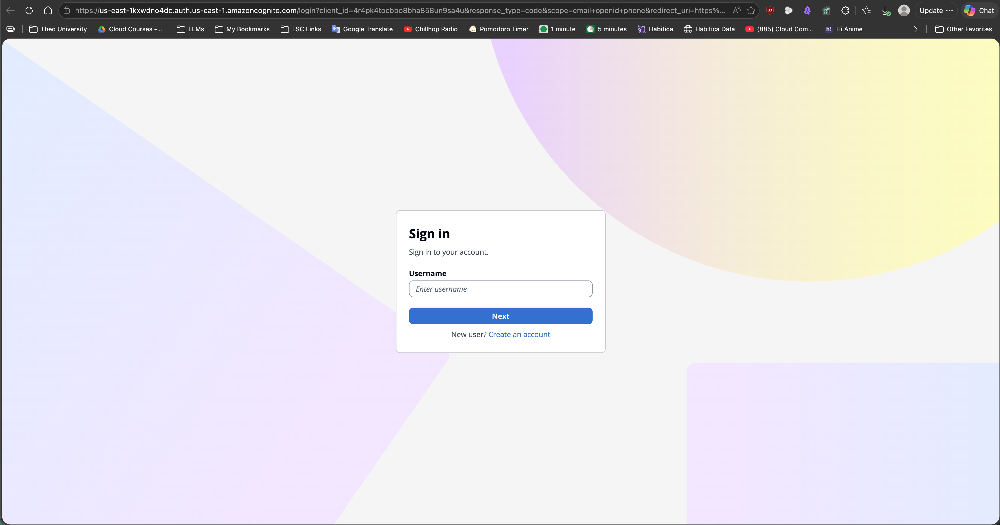

## 12. Create The Test User

Create the user in Cognito, then complete the hosted login flow for continuity.

### 12.1 Admin Create The User

#### Steps

1. Open the user pool.
2. Click **Users**.
3. Click **Create user**.

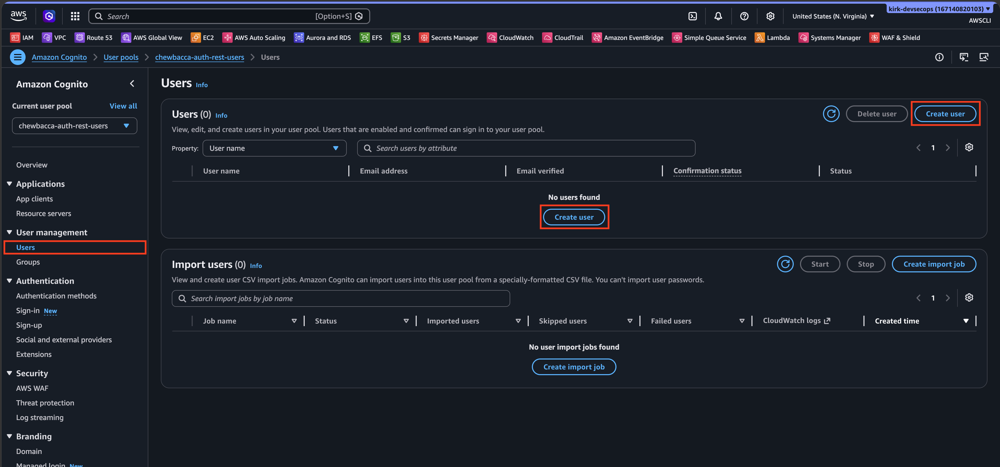

4. Enter these values:

| Setting | Value |
| --- | --- |
| Username | `chewbacca` |
| Email | `$TEST_EMAIL` |
| Invitation | Do not send invitation |
| Temporary password | `Wookiee#TEMP1!` |

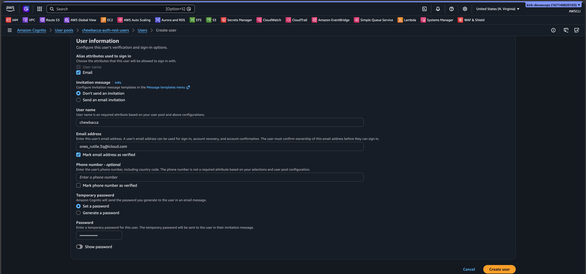

5. Click **Create user**.


### 12.2 Managed Login Completion Path

Use this option when you want the user to experience the hosted Cognito login flow:

#### Steps

1. Open **View login page** from the app client.


2. Sign in with username `chewbacca`.
3. Enter temporary password `Wookiee#TEMP1!`.

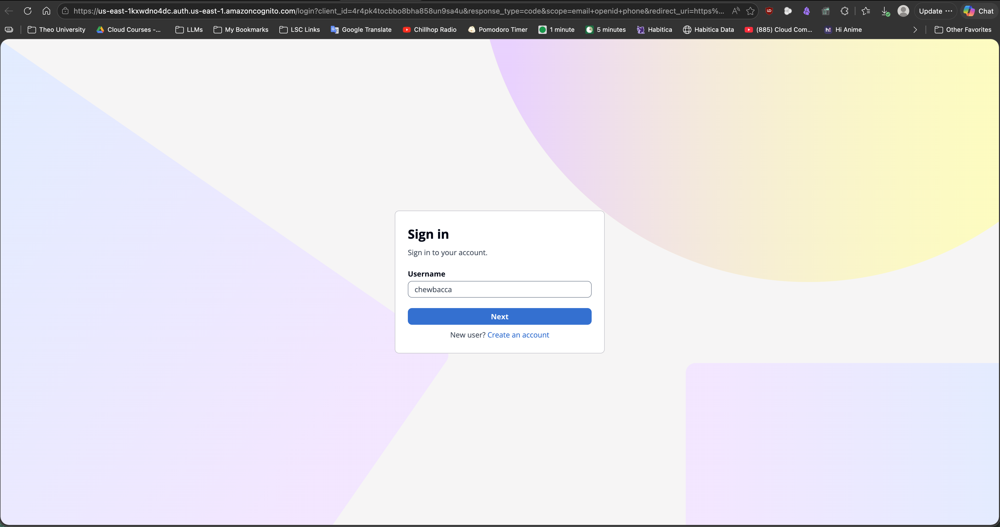


4. Change password to `Wookiee#2026!`.
5. Enter full name `Chewbacca Raaawr`.
6. Enter a real phone number if prompted.

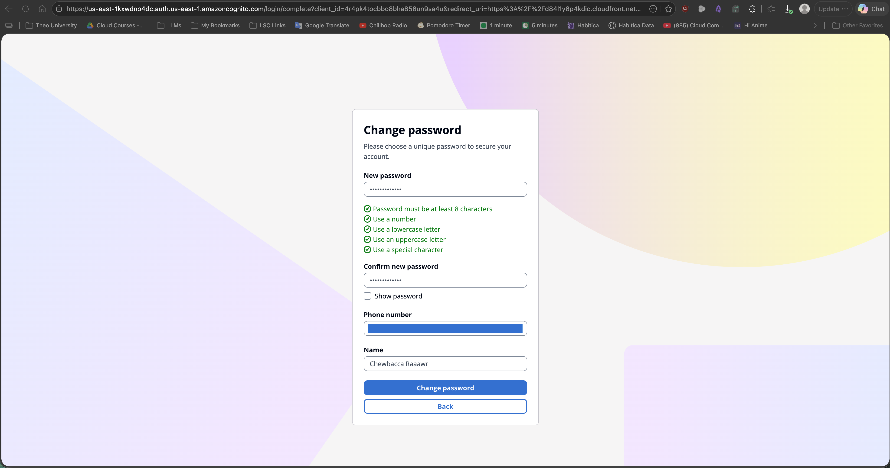

If the challenge takes too long, Cognito may show a session expiration warning:

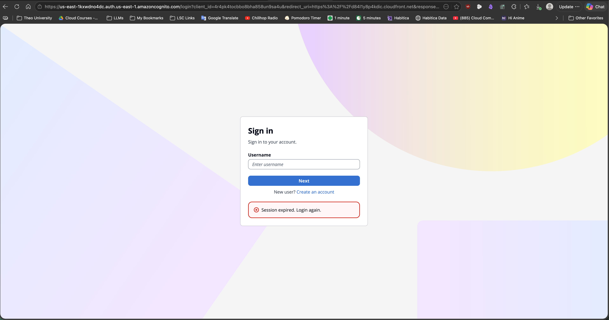

7. Set up authenticator app MFA.


8. Scan the QR code or click **Show secret key** and add the key manually to your authenticator app.


9. Enter the current authenticator code.

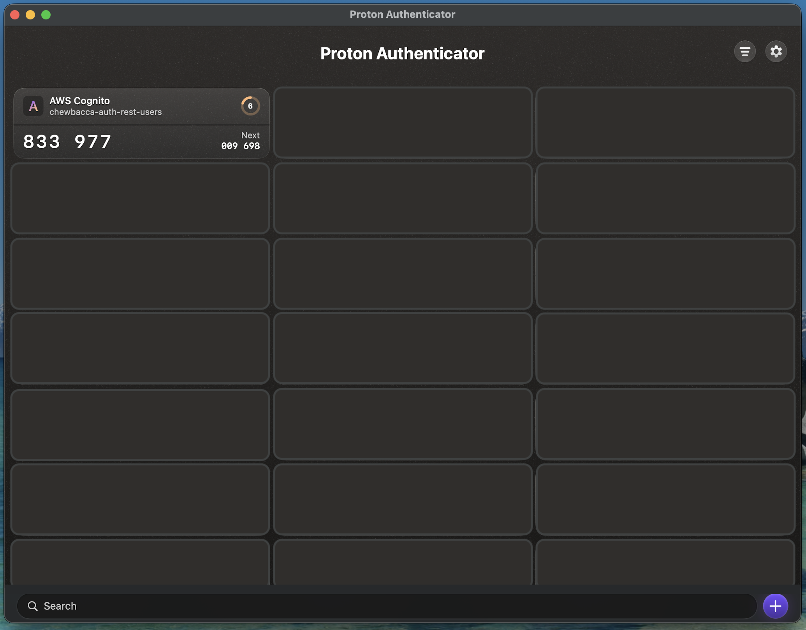

10. Click **Sign in**.


> [!NOTE]
> If the challenge session expires during managed login, restart the hosted login sequence. This runbook uses a 15-minute authentication flow session duration; access and ID tokens remain valid for 60 minutes.

Alternate temporary-password challenge flow:

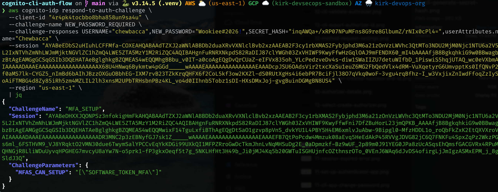


---

# API Gateway Authorization

## 13. Add The REST API Cognito Authorizer

### Steps

1. Open `chewbacca-auth-rest-api` in API Gateway.
2. Click **Authorizers**.
3. Click **Create authorizer**.

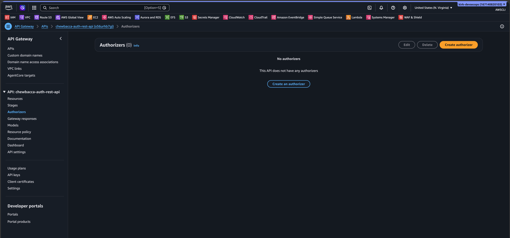

4. Enter these values:

| Setting | Value |
| --- | --- |
| Authorizer name | `chewbacca-auth-rest-cognito-authorizer` |
| Authorizer type | Cognito |
| Cognito user pool | `chewbacca-auth-rest-users` |
| Token source | `Authorization` |

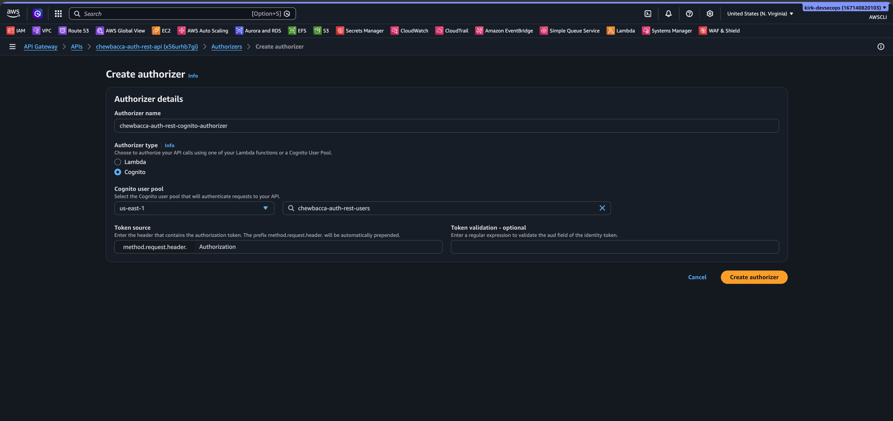

5. Click **Create authorizer**.
6. After authorizer creation succeeds, note the authorizer ID for `chewbacca-auth-rest-cognito-authorizer`.


7. Export the authorizer ID:

```bash
export COGNITO_AUTHORIZER_ID="<COGNITO_AUTHORIZER_ID_FROM_CONSOLE>"
echo "$COGNITO_AUTHORIZER_ID"
```

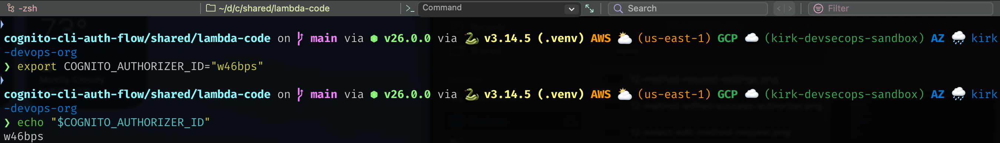

8. Click **Resources**.
9. Select `/jedi`.
10. Select the `GET` method.
11. In the **Method request settings** tile, click **Edit**.


12. Set authorization type to the Cognito user pool authorizer.
13. Select `chewbacca-auth-rest-cognito-authorizer` from the authorizer dropdown.
14. Add authorization scope `aws.cognito.signin.user.admin`.


15. Click **Save**.

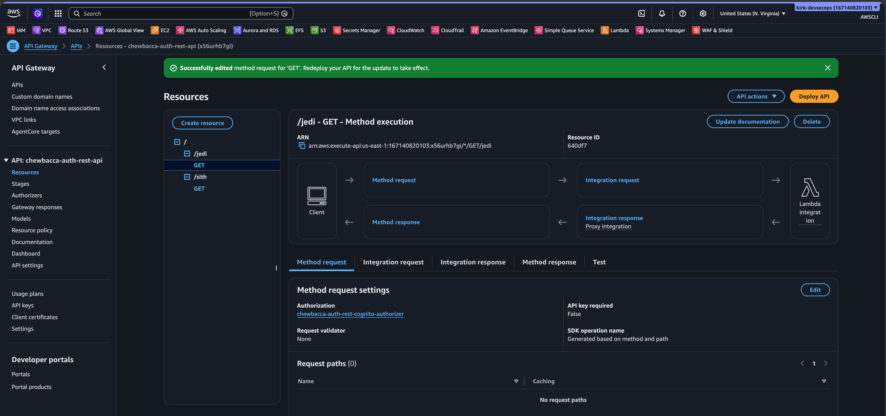

16. Repeat steps 8-15 for `/sith` `GET`.
17. Click **Deploy API**.
18. Deploy to the existing `prod` stage.
19. Use deployment description `Protected Jedi and Sith routes with Cognito authorizer and scope`.

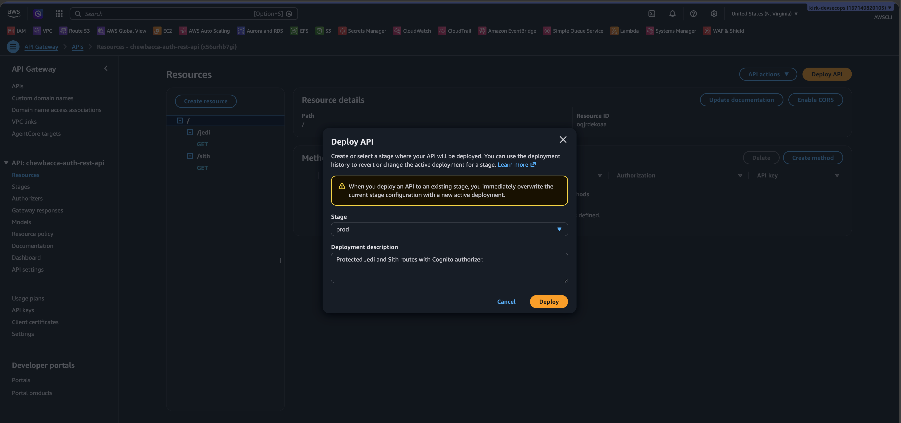

Validate the authorizer:

```bash
aws apigateway get-authorizer \
  --rest-api-id "$REST_API_ID" \
  --authorizer-id "$COGNITO_AUTHORIZER_ID" \
  --region "$AWS_REGION"
```


> [!IMPORTANT]
> Because the methods now require `aws.cognito.signin.user.admin`, protected route tests must send an access token. ID tokens identify the user, but access tokens carry authorization scopes.

## 14. Test Authorizer Enforcement Without A Token

Call the protected routes with no `Authorization` header:

```bash
curl -i "${API_ENDPOINT}/prod/jedi?name=Chewbacca"
```

```bash
curl -i "${API_ENDPOINT}/prod/sith?name=Chewbacca"
```

Expected:

```text
HTTP/2 401
{"message":"Unauthorized"}
```

Unauthorized response confirmation:

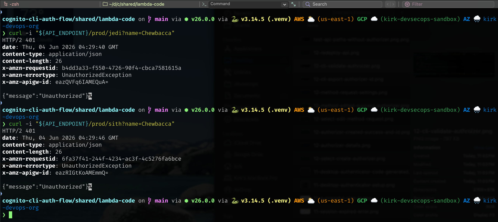

Validation:

- Missing token returns `401`.
- Lambda does not run.
- If the route still returns `200`, redeploy the API or recheck method authorization settings.


---

# Authentication And Route Testing

## 15. Token Helper Script Authentication With The No-Secret Client

Use the default no-secret app client named `chewbacca-auth-rest-users`.

Export token helper script values:

```bash
export COGNITO_USERNAME="$TEST_USERNAME"
export COGNITO_PASSWORD="$TEST_PASSWORD"
export API_BASE="${API_ENDPOINT}/prod"

echo "$COGNITO_PUBLIC_CLIENT_ID"
echo "$COGNITO_USERNAME"
echo "$API_BASE"
```

If you did not already export the no-secret client ID:

```bash
export COGNITO_PUBLIC_CLIENT_ID=$(aws cognito-idp list-user-pool-clients \
  --user-pool-id "$USER_POOL_ID" \
  --query "UserPoolClients[?ClientName=='${DEFAULT_APP_CLIENT_NAME}'].ClientId | [0]" \
  --output text \
  --region "$AWS_REGION")
```

Public app client lookup for token helper scripts:

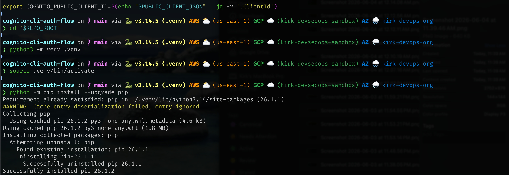

Install dependencies for token helper scripts:

```bash
cd "$REPO_ROOT"
python3 -m venv .venv
source .venv/bin/activate
python -m pip install --upgrade pip
python -m pip install -r requirements.txt
```

Token helper script dependency install:


Run the `easier_get_token.py` script:

```bash
python shared/scripts/easier_get_token.py
```

`easier_get_token.py` run output:


`easier_get_token.py` token response:


`easier_get_token.py` token output:


Run the `flavor_get_token.py` script:

```bash
python shared/scripts/flavor_get_token.py
```

`flavor_get_token.py` script output:


The `flavor_get_token.py` script should decode token claims and print curl examples for:

```text
${API_BASE}/jedi
${API_BASE}/sith
```

Curl examples from `flavor_get_token.py`:

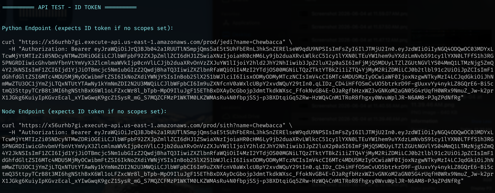

Access token claims:

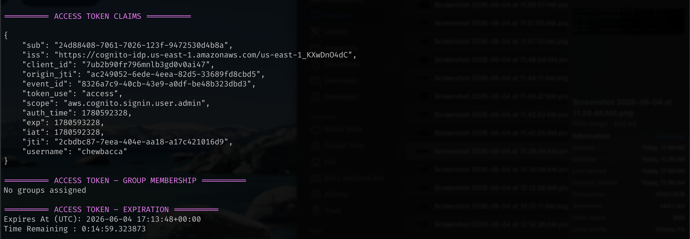

Token helper script API test with access token:

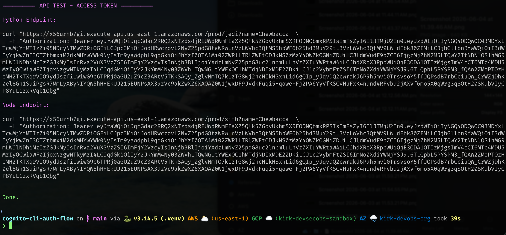

> [!NOTE]
> If the selected app client has a secret, the token helper script flow will fail because these scripts do not send `SECRET_HASH`.

## 16. Test Protected REST API Routes With Access Tokens

Because the REST methods require `aws.cognito.signin.user.admin`, use an access token from `easier_get_token.py` or `flavor_get_token.py`.

Copy the access token from the token helper script output:

```bash
export ACCESS_TOKEN="<ACCESS_TOKEN_FROM_TOKEN_HELPER_SCRIPT>"
```

Literal token form:

```bash
curl -i \
  -H "Authorization: Bearer <ACCESS_TOKEN>" \
  "<API_ENDPOINT>/prod/jedi?name=Chewbacca"
```

Exported token form:

```bash
curl -i \
  -H "Authorization: Bearer $ACCESS_TOKEN" \
  "${API_ENDPOINT}/prod/jedi?name=Chewbacca"

curl -i \
  -H "Authorization: Bearer $ACCESS_TOKEN" \
  "${API_ENDPOINT}/prod/sith?name=Chewbacca"
```

Expected:

```text
HTTP/2 200
```

Protected route tests:

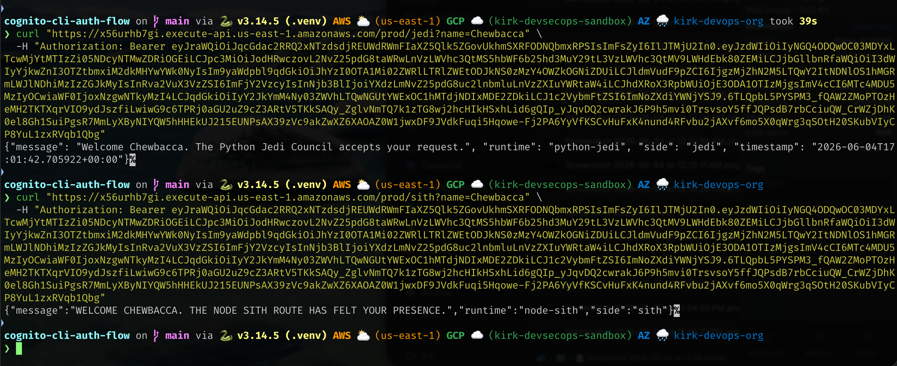

Protected Jedi route returns HTTP 200:

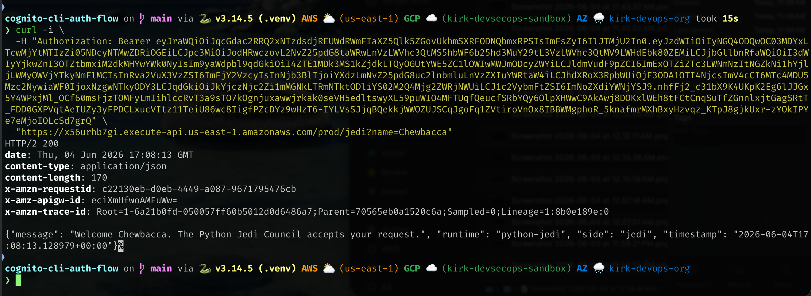

Validation:

- Public route test before authorizer returns `200`.
- Missing token after authorizer returns `401`.
- Access token after successful MFA returns `200`.
- Lambda logs appear only when authorization succeeds.

## 17. Optional SECRET_HASH Validation

Use this section only when you need to validate the optional secret-bearing app client and `SECRET_HASH` flow.

Export aliases used by the auth commands:

```bash
export USERNAME="$TEST_USERNAME"
export USER_PASSWORD="$TEST_PASSWORD"
```

Generate `SECRET_HASH`:

```bash
cd "$REPO_ROOT"

export SECRET_HASH=$(python3 shared/scripts/secret_hash.py \
  "$USERNAME" \
  "$CLIENT_ID" \
  "$CLIENT_SECRET")

echo "${SECRET_HASH:0:20}"
```

Secret hash generation:


Secret hash export confirmation:


### 17.1 Enroll TOTP With A Temporary Access Token

Use `USER_PASSWORD_AUTH` to obtain an access token for MFA setup. This access token is only used for enrollment.

```bash
aws cognito-idp initiate-auth \
  --client-id "$CLIENT_ID" \
  --auth-flow USER_PASSWORD_AUTH \
  --auth-parameters USERNAME="$USERNAME",PASSWORD="$USER_PASSWORD",SECRET_HASH="$SECRET_HASH" \
  --region "$AWS_REGION" | jq
```

Initial TOTP setup attempt:


Export the temporary access token:

```bash
export TEMP_ACCESS_TOKEN=$(aws cognito-idp initiate-auth \
  --client-id "$CLIENT_ID" \
  --auth-flow USER_PASSWORD_AUTH \
  --auth-parameters USERNAME="$USERNAME",PASSWORD="$USER_PASSWORD",SECRET_HASH="$SECRET_HASH" \
  --region "$AWS_REGION" \
  --query 'AuthenticationResult.AccessToken' \
  --output text)
```

Associate a software token:

```bash
aws cognito-idp associate-software-token \
  --access-token "$TEMP_ACCESS_TOKEN" \
  --region "$AWS_REGION" | jq
```

Expected:

```json
{
  "SecretCode": "ABCDEFGHIJKLMNOP"
}
```

Associate software token:


Copy `SecretCode` into your authenticator app as a manual secret.

Verify the software token with a valid TOTP code from your authenticator app:

```bash
export TOTP_CODE="<FRESH_6_DIGIT_CODE>"

aws cognito-idp verify-software-token \
  --access-token "$TEMP_ACCESS_TOKEN" \
  --user-code "$TOTP_CODE" \
  --friendly-device-name "Chewbacca CLI REST" \
  --region "$AWS_REGION" | jq
```

Expected:

```json
{
  "Status": "SUCCESS"
}
```

Verify software token:

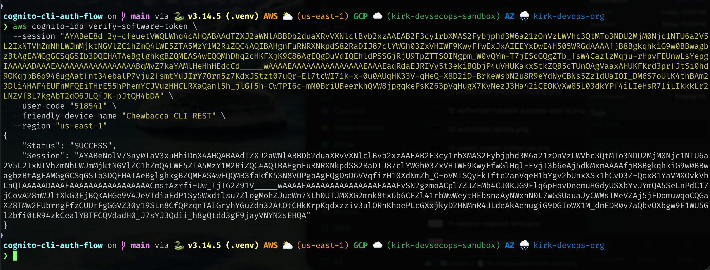

Set software token MFA as preferred:

```bash
aws cognito-idp set-user-mfa-preference \
  --access-token "$TEMP_ACCESS_TOKEN" \
  --software-token-mfa-settings Enabled=true,PreferredMfa=true \
  --region "$AWS_REGION"
```

> [!NOTE]
> If the user already enrolled MFA through managed login, you can skip the enrollment commands and continue with `USER_AUTH`.

> [!NOTE]
> The two software-token screenshots above show the challenge-session enrollment variant. The primary command flow in this runbook uses `TEMP_ACCESS_TOKEN`; both approaches are valid Cognito enrollment patterns when the session or access token belongs to the same active authentication flow.

### 17.2 Alternate Option: Enroll TOTP Through Managed Login

Use this option when you want to enroll MFA through the hosted Cognito login page instead of the CLI software-token commands.

1. Open **View login page** from the CLI app client.


2. Sign in with username `chewbacca` and the temporary password.


3. Change the temporary password to the permanent password exported earlier.


4. Continue to authenticator app setup.


5. Scan the QR code or click **Show secret key** and add the key manually to your authenticator app.


6. Use a valid TOTP code from your authenticator app.


7. Complete sign-in.


After this flow, continue with `USER_AUTH`. You do not need to repeat the CLI software-token enrollment commands unless you want to practice both methods.

### 17.3 Start `USER_AUTH`

Start `USER_AUTH` and save the returned `Session` value.

```bash
export AUTH_RESPONSE=$(aws cognito-idp initiate-auth \
  --client-id "$CLIENT_ID" \
  --auth-flow USER_AUTH \
  --auth-parameters USERNAME="$USERNAME",SECRET_HASH="$SECRET_HASH" \
  --region "$AWS_REGION")

echo "$AUTH_RESPONSE" | jq
```

Expected:

```json
{
  "ChallengeName": "SELECT_CHALLENGE",
  "Session": "AYABe...<SELECT_CHALLENGE_SESSION>",
  "AvailableChallenges": ["PASSWORD", "PASSWORD_SRP"]
}
```

Export the session:

```bash
export SESSION=$(echo "$AUTH_RESPONSE" | jq -r '.Session')
echo "${SESSION:0:20}"
```

`USER_AUTH` returns `SELECT_CHALLENGE`:


### 17.4 Answer `SELECT_CHALLENGE` With `PASSWORD`

```bash
export PASSWORD_CHALLENGE_RESPONSE=$(aws cognito-idp respond-to-auth-challenge \
  --client-id "$CLIENT_ID" \
  --challenge-name SELECT_CHALLENGE \
  --challenge-responses USERNAME="$USERNAME",ANSWER="PASSWORD",PASSWORD="$USER_PASSWORD",SECRET_HASH="$SECRET_HASH" \
  --session "$SESSION" \
  --region "$AWS_REGION")

echo "$PASSWORD_CHALLENGE_RESPONSE" | jq
```

Expected:

```json
{
  "ChallengeName": "SOFTWARE_TOKEN_MFA",
  "Session": "AYABe...<SOFTWARE_TOKEN_MFA_SESSION>"
}
```

Update the session:

```bash
export SESSION=$(echo "$PASSWORD_CHALLENGE_RESPONSE" | jq -r '.Session')
```

> [!WARNING]
> Do not reuse the `SELECT_CHALLENGE` session for MFA. The password step returns a new session.

`SELECT_CHALLENGE` answered with `PASSWORD`:


### 17.5 Respond To `SOFTWARE_TOKEN_MFA`

Use a valid TOTP code from your authenticator app:

```bash
export TOTP_CODE="<FRESH_6_DIGIT_CODE>"

export MFA_RESPONSE=$(aws cognito-idp respond-to-auth-challenge \
  --client-id "$CLIENT_ID" \
  --challenge-name SOFTWARE_TOKEN_MFA \
  --challenge-responses USERNAME="$USERNAME",SOFTWARE_TOKEN_MFA_CODE="$TOTP_CODE",SECRET_HASH="$SECRET_HASH" \
  --session "$SESSION" \
  --region "$AWS_REGION")

echo "$MFA_RESPONSE" | jq
```

MFA challenge response:


Export tokens:

```bash
export ACCESS_TOKEN=$(echo "$MFA_RESPONSE" | jq -r '.AuthenticationResult.AccessToken')
export ID_TOKEN=$(echo "$MFA_RESPONSE" | jq -r '.AuthenticationResult.IdToken')
export REFRESH_TOKEN=$(echo "$MFA_RESPONSE" | jq -r '.AuthenticationResult.RefreshToken')

echo "${ACCESS_TOKEN:0:24}"
echo "${ID_TOKEN:0:24}"
echo "${REFRESH_TOKEN:0:24}"
```

Returned token export:


Authentication result:


> [!IMPORTANT]
> Use `$ACCESS_TOKEN` for the scoped API Gateway method tests. The ID token is still useful for inspecting identity claims, but it is not the token to send when method authorization scopes are configured.

## 18. Optional Direct Flow Shortcut

Use this optional shortcut after validating the secret-bearing app client. `USER_PASSWORD_AUTH` skips `SELECT_CHALLENGE` and goes directly to password validation, then MFA.

```bash
export DIRECT_AUTH_RESPONSE=$(aws cognito-idp initiate-auth \
  --client-id "$CLIENT_ID" \
  --auth-flow USER_PASSWORD_AUTH \
  --auth-parameters USERNAME="$USERNAME",PASSWORD="$USER_PASSWORD",SECRET_HASH="$SECRET_HASH" \
  --region "$AWS_REGION")

echo "$DIRECT_AUTH_RESPONSE" | jq
```

Expected:

```json
{
  "ChallengeName": "SOFTWARE_TOKEN_MFA",
  "Session": "AYABe...<SOFTWARE_TOKEN_MFA_SESSION>"
}
```

Direct flow shortcut response:


This shortcut bypasses the `SELECT_CHALLENGE` negotiation step.


---

# Operations

## Troubleshooting

| Symptom | Likely cause | Fix |
| --- | --- | --- |
| `Unable to verify secret hash` | Wrong username, client ID, client secret, or copied hash | Regenerate `SECRET_HASH` using the exact username, client ID, and client secret |
| `InvalidParameterException` for `USER_AUTH` | App client does not allow `ALLOW_USER_AUTH` | Edit the app client and enable choice-based sign-in |
| `Invalid session` | Session reused from the wrong flow, user, app client, or expired challenge chain | Restart from `USER_AUTH` and use each new session in order |
| `CodeMismatchException` | Expired or incorrect TOTP code | Wait for a newly generated code and retry |
| MFA not challenged after password | User has not enrolled TOTP or MFA preference is not set | Complete MFA enrollment again |
| `{"message":"Unauthorized"}` with token | Wrong token type, expired token, missing scope, bad header, or stale deployment | Use `$ACCESS_TOKEN`, confirm `aws.cognito.signin.user.admin` scope, and redeploy |
| Route still public | Method authorization changed but API was not redeployed | Deploy the API to `prod` again |
| Lambda never logs during failed auth | Expected behavior | API Gateway rejects invalid requests before Lambda runs |

---

# References

## References

| Topic | References |
| --- | --- |
| Cognito user pool setup and managed login | [Cognito User Pools](https://docs.aws.amazon.com/cognito/latest/developerguide/cognito-user-identity-pools.html), [Managed login and hosted UI](https://docs.aws.amazon.com/cognito/latest/developerguide/cognito-user-pools-hosted-ui-user-experience.html), [Managed login endpoints](https://docs.aws.amazon.com/cognito/latest/developerguide/managed-login-endpoints.html), [Managed login branding](https://docs.aws.amazon.com/cognito/latest/developerguide/managed-login-branding.html) |
| Cognito direct authentication and MFA | [Cognito authentication flows](https://docs.aws.amazon.com/cognito/latest/developerguide/authentication.html), [Cognito MFA](https://docs.aws.amazon.com/cognito/latest/developerguide/user-pool-settings-mfa.html), [InitiateAuth API](https://docs.aws.amazon.com/cognito-user-identity-pools/latest/APIReference/API_InitiateAuth.html), [RespondToAuthChallenge API](https://docs.aws.amazon.com/cognito-user-identity-pools/latest/APIReference/API_RespondToAuthChallenge.html), [Computing secret hash values](https://docs.aws.amazon.com/cognito/latest/developerguide/signing-up-users-in-your-app.html#cognito-user-pools-computing-secret-hash) |
| Cognito OAuth tokens and logout | [Authorization endpoint](https://docs.aws.amazon.com/cognito/latest/developerguide/authorization-endpoint.html), [Token endpoint](https://docs.aws.amazon.com/cognito/latest/developerguide/token-endpoint.html), [Logout endpoint](https://docs.aws.amazon.com/cognito/latest/developerguide/logout-endpoint.html) |
| JWT claims, access tokens, and API authorization | [JWT introduction](https://jwt.io/introduction), [REST API Cognito authorizers](https://docs.aws.amazon.com/apigateway/latest/developerguide/apigateway-integrate-with-cognito.html) |
| REST API routing and Lambda integration | [API Gateway REST APIs](https://docs.aws.amazon.com/apigateway/latest/developerguide/apigateway-rest-api.html), [REST API Lambda proxy integrations](https://docs.aws.amazon.com/apigateway/latest/developerguide/set-up-lambda-proxy-integrations.html), [Invoking Lambda with API Gateway](https://docs.aws.amazon.com/lambda/latest/dg/services-apigateway.html) |
| Lambda runtime configuration and roles | [AWS Lambda](https://docs.aws.amazon.com/lambda/latest/dg/welcome.html), [Lambda execution roles](https://docs.aws.amazon.com/lambda/latest/dg/lambda-intro-execution-role.html), [Lambda environment variables](https://docs.aws.amazon.com/lambda/latest/dg/configuration-envvars.html) |
| CloudWatch validation evidence | [CloudWatch Logs for Lambda](https://docs.aws.amazon.com/lambda/latest/dg/monitoring-cloudwatchlogs.html) |

## CLI Command References

### General CLI References

| Command | Reference |
| --- | --- |
| `python3 -m venv` | [Python venv](https://docs.python.org/3/library/venv.html) |
| `python3` | [Python command line](https://docs.python.org/3/using/cmdline.html) |
| `pip` | [pip CLI](https://pip.pypa.io/en/stable/cli/) |
| `curl` | [curl man page](https://curl.se/docs/manpage.html) |
| `jq` | [jq manual](https://jqlang.github.io/jq/manual/) |
| `zip` | [Info-ZIP manual](https://infozip.sourceforge.net/Zip.html) |


### AWS CLI References

| Command | AWS CLI reference |
| --- | --- |
| `aws sts get-caller-identity` | [sts get-caller-identity](https://docs.aws.amazon.com/cli/latest/reference/sts/get-caller-identity.html) |
| `aws lambda get-function` | [lambda get-function](https://docs.aws.amazon.com/cli/latest/reference/lambda/get-function.html) |
| `aws lambda invoke` | [lambda invoke](https://docs.aws.amazon.com/cli/latest/reference/lambda/invoke.html) |
| `aws cognito-idp describe-user-pool-client` | [cognito-idp describe-user-pool-client](https://docs.aws.amazon.com/cli/latest/reference/cognito-idp/describe-user-pool-client.html) |
| `aws apigateway get-authorizer` | [apigateway get-authorizer](https://docs.aws.amazon.com/cli/latest/reference/apigateway/get-authorizer.html) |
| `aws cognito-idp list-user-pool-clients` | [cognito-idp list-user-pool-clients](https://docs.aws.amazon.com/cli/latest/reference/cognito-idp/list-user-pool-clients.html) |
| `aws cognito-idp initiate-auth` | [cognito-idp initiate-auth](https://docs.aws.amazon.com/cli/latest/reference/cognito-idp/initiate-auth.html) |
| `aws cognito-idp associate-software-token` | [cognito-idp associate-software-token](https://docs.aws.amazon.com/cli/latest/reference/cognito-idp/associate-software-token.html) |
| `aws cognito-idp verify-software-token` | [cognito-idp verify-software-token](https://docs.aws.amazon.com/cli/latest/reference/cognito-idp/verify-software-token.html) |
| `aws cognito-idp set-user-mfa-preference` | [cognito-idp set-user-mfa-preference](https://docs.aws.amazon.com/cli/latest/reference/cognito-idp/set-user-mfa-preference.html) |
| `aws cognito-idp respond-to-auth-challenge` | [cognito-idp respond-to-auth-challenge](https://docs.aws.amazon.com/cli/latest/reference/cognito-idp/respond-to-auth-challenge.html) |
