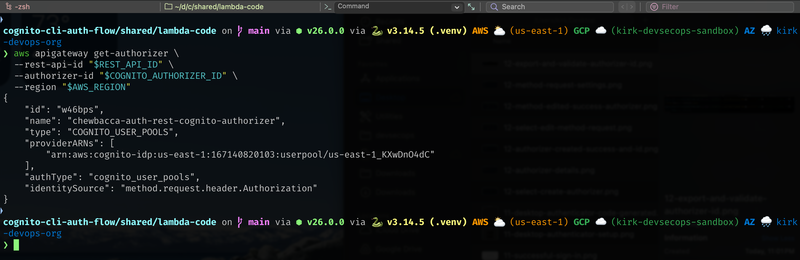

# Cognito Auth Flow - REST Lab - CLI

## Purpose

Build the Cognito Auth Flow REST API lab with AWS CLI commands, then practice MFA enrollment, Cognito challenge responses, token helper scripts, and protected Jedi/Sith route validation.

### Details

Lab details:

- Cognito User Pool and app clients for managed login, token helper scripts, and `SECRET_HASH` practice
- Chewbacca test user with software-token MFA
- Jedi Python Lambda and Sith Node.js Lambda route handlers
- API Gateway REST API resources, methods, Lambda proxy integrations, and `prod` stage
- REST API Cognito User Pool authorizer with protected `/prod/jedi` and `/prod/sith` routes
- Manual `USER_AUTH`, `SELECT_CHALLENGE`, `PASSWORD`, and `SOFTWARE_TOKEN_MFA` practice path
- Managed Login page, access-token route tests, CloudWatch validation evidence, and final concept checks


## Prerequisites

### Dependencies

#### Applications

| Dependency | Requirement |
| --- | --- |
| AWS CLI | Create, update, describe, validate, and tear down AWS resources. |
| jq | Parse JSON responses and export generated IDs, tokens, or ARNs. |
| Python 3 | Run helper scripts and package Python-based Lambda code when required. |
| zip | Package Lambda source files for upload. |
| curl | Validate API routes and HTTP responses. |

#### Infrastructure

| Dependency | Requirement |
| --- | --- |
| AWS account and region | Create the REST lab resources in the intended account and region. |
| IAM capability | Create roles, attach policies, and add Lambda invoke permissions. |
| Local workspace | Copy `env.example` to `.env` and keep lab values grouped as resources are created. |

#### Access Requirements

| Dependency | Requirement |
| --- | --- |
| AWS credentials | Use credentials with permission to manage IAM, Lambda, API Gateway, Cognito, and CloudWatch. |
| Authenticator app | Generate valid TOTP codes for software-token MFA practice. |
| Lab sandbox when directed | Use sandbox folders for local edits or copied starter files instead of pre-filled quick deployments. |

#### APIs And Services

| Dependency | Requirement |
| --- | --- |
| Amazon Cognito | User Pool, app clients, software-token MFA, managed login, and auth challenge flows. |
| AWS Lambda | Jedi Python and Sith Node.js route handlers. |
| API Gateway REST API | Resources, methods, Lambda proxy integrations, stage deployment, and Cognito User Pool authorizer. |
| IAM | Execution roles and Lambda permissions. |
| CloudWatch Logs | Evidence for direct Lambda invocation and authorized route execution. |

### Supporting Files

| File | Use |
| --- | --- |
| [`../env.example`](../env.example) | Lab value template copied to `.env` before building. |
| [`../LAB-README.md`](../LAB-README.md) | Lab overview, path selection, asset map, and concept overview. |
| [`LAB-CONSOLE.md`](LAB-CONSOLE.md) | Companion lab path for the same deployment. |
| [`TEARDOWN_REST.md`](TEARDOWN_REST.md) | Lab teardown for resources created by this lab. |
| [`../../../../shared/lambda-code/`](../../../../shared/lambda-code/) | Shared Jedi and Sith Lambda handlers copied or packaged during the lab. |
| [`../../../../shared/scripts/`](../../../../shared/scripts/) | Secret hash and token helper scripts used after manual auth flow practice. |
| [`../../../../requirements.txt`](../../../../requirements.txt) | Python dependencies for token helper scripts. |
| [`../../../../assets/images/`](../../../../assets/images/) | Screenshots placed near matching lab steps. |

### Authentication and Authorization Flow

```text
User initiates authentication with Amazon Cognito
        ↓
Cognito validates credentials and required MFA challenges
        ↓
Cognito issues JWT tokens
        ↓
Client sends an API request with an access token
        ↓
API Gateway validates the JWT signature, claims, and required scope
        ↓
Authorized requests are routed to the appropriate Lambda function
        ↓
Unauthorized requests are rejected by API Gateway
        ↓
CloudWatch logs and metrics provide visibility into request processing
```

This flow uses:

- Chewbacca test user
- Cognito User Pool
- default public app client for token helper scripts
- additional secret-bearing CLI app client for `SECRET_HASH`
- `USER_AUTH` and `SELECT_CHALLENGE`
- `PASSWORD`
- `SOFTWARE_TOKEN_MFA`
- access token with `aws.cognito.signin.user.admin` scope
- API Gateway REST API Cognito User Pool authorizer
- protected `/prod/jedi` and `/prod/sith` Lambda routes

> [!IMPORTANT]
> REST methods are protected with an authorization scope. Once `aws.cognito.signin.user.admin` is configured on the API methods, use the Cognito **access token** for protected route tests. Do not use the ID token for the scoped route test.

### Environment Checks

Confirm AWS identity:

```bash
aws sts get-caller-identity
```

Set the repo root before running packaging, helper scripts, or validation commands:

```bash
export REPO_ROOT="<COGNITO_CLI_AUTH_FLOW_REPO_ROOT>"
cd "$REPO_ROOT"
```
---

# Preparation

## 1. Create And Load The Environment File

An environment file helps simplify deployment and provides a record of planned values and resource outputs. You will copy the dotenv template, rename the copy to `.env`, update initial values, then reload it before running commands that depend on those values.

Copy the template:

```bash
cp "$REPO_ROOT/REST/labs/cognito-auth-flow-REST/env.example" \
  "$REPO_ROOT/REST/labs/cognito-auth-flow-REST/.env"
```

Set the environment file path:

```bash
export LAB_ENV="$REPO_ROOT/REST/labs/cognito-auth-flow-REST/.env"
```

Get the AWS account ID:

```bash
aws sts get-caller-identity --query Account --output text
```

Open `.env` in VS Code or your editor of choice:

```bash
code "$LAB_ENV"
```

In `.env`, update the foundational inputs and review the planned values before building:

```bash
REPO_ROOT="/Users/kirk/devsecops/cognito-cli-auth-flow"
AWS_ACCOUNT_ID="123456789012"
AWS_REGION="us-east-1"
PROJECT_NAME="chewbacca-auth-rest"
TEST_USERNAME="chewbacca"
TEST_EMAIL="chewbacca@example.com"
TEST_PASSWORD="Wookiee#2026!"
TEMP_PASSWORD="Wookiee#TEMP1!"
```

Save `.env`, then load it for the build phase:

```bash
set -a
source "$LAB_ENV"
set +a
```

Validate the starting values before building:

```bash
echo "AWS_REGION=$AWS_REGION"
echo "AWS_ACCOUNT_ID=$AWS_ACCOUNT_ID"
echo "PROJECT_NAME=$PROJECT_NAME"
echo "JEDI_FUNCTION=$JEDI_FUNCTION"
echo "SITH_FUNCTION=$SITH_FUNCTION"
echo "API_NAME=$API_NAME"
echo "USER_POOL_NAME=$USER_POOL_NAME"
echo "AUTHORIZER_NAME=$AUTHORIZER_NAME"
```

> [!NOTE]
> Keep stable infrastructure values in `.env`. Keep short-lived values like `SESSION`, `TOTP_CODE`, `SECRET_HASH`, `ACCESS_TOKEN`, `ID_TOKEN`, `REFRESH_TOKEN`, and full auth responses in the terminal only.


---

# Lambda Foundation

## 2. Create Lambda Execution Roles


### Commands

Create the Python role:

```bash
aws iam create-role \
  --role-name "$PYTHON_LAMBDA_ROLE_NAME" \
  --assume-role-policy-document '{
    "Version": "2012-10-17",
    "Statement": [
      {
        "Effect": "Allow",
        "Principal": {
          "Service": "lambda.amazonaws.com"
        },
        "Action": "sts:AssumeRole"
      }
    ]
  }'

aws iam attach-role-policy \
  --role-name "$PYTHON_LAMBDA_ROLE_NAME" \
  --policy-arn arn:aws:iam::aws:policy/service-role/AWSLambdaBasicExecutionRole
```

Create the Node role:

```bash
aws iam create-role \
  --role-name "$NODE_LAMBDA_ROLE_NAME" \
  --assume-role-policy-document '{
    "Version": "2012-10-17",
    "Statement": [
      {
        "Effect": "Allow",
        "Principal": {
          "Service": "lambda.amazonaws.com"
        },
        "Action": "sts:AssumeRole"
      }
    ]
  }'

aws iam attach-role-policy \
  --role-name "$NODE_LAMBDA_ROLE_NAME" \
  --policy-arn arn:aws:iam::aws:policy/service-role/AWSLambdaBasicExecutionRole
```

Export role ARNs:

```bash
export PYTHON_LAMBDA_ROLE_ARN=$(aws iam get-role \
  --role-name "$PYTHON_LAMBDA_ROLE_NAME" \
  --query 'Role.Arn' \
  --output text)

export NODE_LAMBDA_ROLE_ARN=$(aws iam get-role \
  --role-name "$NODE_LAMBDA_ROLE_NAME" \
  --query 'Role.Arn' \
  --output text)

echo "$PYTHON_LAMBDA_ROLE_ARN"
echo "$NODE_LAMBDA_ROLE_ARN"
```

Give IAM a few seconds to propagate.


## 3. Package Lambda Code

Package the shared Lambda handlers with the default filenames expected by the Lambda console handlers.

```bash
cd "$REPO_ROOT/shared/lambda-code"

cp jedi_python.py lambda_function.py
zip jedi-python.zip lambda_function.py

cp sith_node.js index.js
zip sith-node.zip index.js
```

Validation:

```bash
ls -lh jedi-python.zip sith-node.zip
```

Packaging confirmation:


## 4. Create The Lambda Functions

Create both Lambda functions from the packaged ZIP files, then export the function ARNs for API Gateway integration.

### Commands

Create the functions:

```bash
aws lambda create-function \
  --function-name "$JEDI_FUNCTION" \
  --runtime python3.12 \
  --role "$PYTHON_LAMBDA_ROLE_ARN" \
  --handler lambda_function.lambda_handler \
  --zip-file fileb://jedi-python.zip \
  --region "$AWS_REGION"

aws lambda create-function \
  --function-name "$SITH_FUNCTION" \
  --runtime nodejs20.x \
  --role "$NODE_LAMBDA_ROLE_ARN" \
  --handler index.handler \
  --zip-file fileb://sith-node.zip \
  --region "$AWS_REGION"
```

Export the function ARNs:

```bash
export JEDI_FUNCTION_ARN=$(aws lambda get-function \
  --function-name "$JEDI_FUNCTION" \
  --query 'Configuration.FunctionArn' \
  --output text \
  --region "$AWS_REGION")

export SITH_FUNCTION_ARN=$(aws lambda get-function \
  --function-name "$SITH_FUNCTION" \
  --query 'Configuration.FunctionArn' \
  --output text \
  --region "$AWS_REGION")

echo "$JEDI_FUNCTION_ARN"
echo "$SITH_FUNCTION_ARN"
```

Function ARN export validation:


## 5. Test Lambda Directly

Invoke the Python Lambda:

```bash
aws lambda invoke \
  --function-name "$JEDI_FUNCTION" \
  --payload '{"queryStringParameters":{"name":"Chewbacca"}}' \
  --cli-binary-format raw-in-base64-out \
  /tmp/chewbacca-rest-jedi-response.json \
  --region "$AWS_REGION"

jq . /tmp/chewbacca-rest-jedi-response.json
```

Expected:

```text
Jedi route returns 200 and a Python Jedi Council message.
```

Jedi Python invoke success:


Invoke the Node Lambda:

```bash
aws lambda invoke \
  --function-name "$SITH_FUNCTION" \
  --payload '{"queryStringParameters":{"name":"Chewbacca"}}' \
  --cli-binary-format raw-in-base64-out \
  /tmp/chewbacca-rest-sith-response.json \
  --region "$AWS_REGION"

jq . /tmp/chewbacca-rest-sith-response.json
```

Expected:

```text
Sith route returns 200 and a Node Sith message.
```

Sith Node invoke success:


---

# API Gateway Baseline

## 6. Create The REST API And Resources

### Commands

Create the REST API:

```bash
export REST_API_ID=$(aws apigateway create-rest-api \
  --name "$API_NAME" \
  --endpoint-configuration types=REGIONAL \
  --query 'id' \
  --output text \
  --region "$AWS_REGION")
```

Export the root resource:

```bash
export ROOT_RESOURCE_ID=$(aws apigateway get-resources \
  --rest-api-id "$REST_API_ID" \
  --query "items[?path=='/'].id | [0]" \
  --output text \
  --region "$AWS_REGION")
```

Create the REST resources:

```bash
export JEDI_RESOURCE_ID=$(aws apigateway create-resource \
  --rest-api-id "$REST_API_ID" \
  --parent-id "$ROOT_RESOURCE_ID" \
  --path-part jedi \
  --query 'id' \
  --output text \
  --region "$AWS_REGION")

export SITH_RESOURCE_ID=$(aws apigateway create-resource \
  --rest-api-id "$REST_API_ID" \
  --parent-id "$ROOT_RESOURCE_ID" \
  --path-part sith \
  --query 'id' \
  --output text \
  --region "$AWS_REGION")
```

If you created the API through clickops, open **API settings** and export the API ID:

```bash
export REST_API_ID="<REST_API_ID_FROM_CONSOLE>"
export API_ENDPOINT="https://${REST_API_ID}.execute-api.${AWS_REGION}.amazonaws.com"
```

If you created the `/jedi` and `/sith` resources through clickops, copy the resource IDs from API Gateway and export them directly:

```bash
export ROOT_RESOURCE_ID="<ROOT_RESOURCE_ID_FROM_CONSOLE>"
export JEDI_RESOURCE_ID="<JEDI_RESOURCE_ID_FROM_CONSOLE>"
export SITH_RESOURCE_ID="<SITH_RESOURCE_ID_FROM_CONSOLE>"
```

Validation:

```bash
echo "$REST_API_ID"
echo "$ROOT_RESOURCE_ID"
echo "$JEDI_RESOURCE_ID"
echo "$SITH_RESOURCE_ID"
echo "$API_ENDPOINT"
```

## 7. Add REST Methods And Lambda Proxy Integrations

Create public `GET` methods before adding Cognito. This proves routing works before authorization.

### Commands

Create the public `GET` methods:

```bash
aws apigateway put-method \
  --rest-api-id "$REST_API_ID" \
  --resource-id "$JEDI_RESOURCE_ID" \
  --http-method GET \
  --authorization-type NONE \
  --region "$AWS_REGION"

aws apigateway put-method \
  --rest-api-id "$REST_API_ID" \
  --resource-id "$SITH_RESOURCE_ID" \
  --http-method GET \
  --authorization-type NONE \
  --region "$AWS_REGION"
```

Add Lambda proxy integrations:

```bash
aws apigateway put-integration \
  --rest-api-id "$REST_API_ID" \
  --resource-id "$JEDI_RESOURCE_ID" \
  --http-method GET \
  --type AWS_PROXY \
  --integration-http-method POST \
  --uri "arn:aws:apigateway:${AWS_REGION}:lambda:path/2015-03-31/functions/${JEDI_FUNCTION_ARN}/invocations" \
  --region "$AWS_REGION"

aws apigateway put-integration \
  --rest-api-id "$REST_API_ID" \
  --resource-id "$SITH_RESOURCE_ID" \
  --http-method GET \
  --type AWS_PROXY \
  --integration-http-method POST \
  --uri "arn:aws:apigateway:${AWS_REGION}:lambda:path/2015-03-31/functions/${SITH_FUNCTION_ARN}/invocations" \
  --region "$AWS_REGION"
```

Allow API Gateway to invoke Lambda:

```bash
aws lambda add-permission \
  --function-name "$JEDI_FUNCTION" \
  --statement-id "${REST_API_ID}-jedi-invoke" \
  --action lambda:InvokeFunction \
  --principal apigateway.amazonaws.com \
  --source-arn "arn:aws:execute-api:${AWS_REGION}:${AWS_ACCOUNT_ID}:${REST_API_ID}/*/GET/jedi" \
  --region "$AWS_REGION"

aws lambda add-permission \
  --function-name "$SITH_FUNCTION" \
  --statement-id "${REST_API_ID}-sith-invoke" \
  --action lambda:InvokeFunction \
  --principal apigateway.amazonaws.com \
  --source-arn "arn:aws:execute-api:${AWS_REGION}:${AWS_ACCOUNT_ID}:${REST_API_ID}/*/GET/sith" \
  --region "$AWS_REGION"
```

Deploy the public API and export the endpoint:

```bash
aws apigateway create-deployment \
  --rest-api-id "$REST_API_ID" \
  --stage-name prod \
  --description "Public Jedi and Sith baseline before Cognito authorizer" \
  --region "$AWS_REGION"

export API_ENDPOINT="https://${REST_API_ID}.execute-api.${AWS_REGION}.amazonaws.com"
```

## 8. Test Unprotected REST Paths Without A Token

These tests should work before the authorizer is attached.

Test the Python route:

```bash
curl -i "${API_ENDPOINT}/prod/jedi?name=Chewbacca"
```

Test the Node route:

```bash
curl -i "${API_ENDPOINT}/prod/sith?name=Chewbacca"
```

Expected:

```text
HTTP/2 200
```

Both unprotected route tests:


Validation:

- API Gateway reaches both Lambda functions.
- CloudWatch logs show Lambda proxy event payloads.
- If either request fails now, fix routing before adding Cognito.


---

# Cognito Identity Configuration

## 9. Create The Cognito User Pool

### Commands

```bash
export USER_POOL_ID=$(aws cognito-idp create-user-pool \
  --pool-name "$USER_POOL_NAME" \
  --mfa-configuration OFF \
  --alias-attributes email \
  --auto-verified-attributes email \
  --schema \
    Name=name,AttributeDataType=String,Required=true,Mutable=true \
    Name=birthdate,AttributeDataType=String,Required=true,Mutable=true \
    Name=phone_number,AttributeDataType=String,Required=true,Mutable=true \
  --policies '{
    "PasswordPolicy": {
      "MinimumLength": 12,
      "RequireUppercase": true,
      "RequireLowercase": true,
      "RequireNumbers": true,
      "RequireSymbols": true
    }
  }' \
  --query 'UserPool.Id' \
  --output text \
  --region "$AWS_REGION")
```

```bash
export COGNITO_ISSUER="https://cognito-idp.${AWS_REGION}.amazonaws.com/${USER_POOL_ID}"
export USER_POOL_ARN="arn:aws:cognito-idp:${AWS_REGION}:${AWS_ACCOUNT_ID}:userpool/${USER_POOL_ID}"

echo "$USER_POOL_ID"
echo "$COGNITO_ISSUER"
echo "$USER_POOL_ARN"
```

## 10. Enable Software Token MFA

### Commands

```bash
aws cognito-idp set-user-pool-mfa-config \
  --user-pool-id "$USER_POOL_ID" \
  --mfa-configuration ON \
  --software-token-mfa-configuration Enabled=true \
  --region "$AWS_REGION"
```

> [!NOTE]
> If you want an easier enrollment flow while testing, use `OPTIONAL` instead of `ON`. The managed login flow in this lab intentionally walks the user through authenticator setup, which is best practice for production use.

## 11. Configure App Clients

This build uses two app clients:

| Client | Secret | Purpose |
| --- | --- | --- |
| Default `chewbacca-auth-rest-users` client | No secret | Managed login and token helper scripts |
| Additional `chewbacca-auth-rest-cli-client` client | Secret | Manual CLI flow with `SECRET_HASH` |

### 11.1 Edit The Default No-Secret App Client

#### Commands

Look up the default app client from the CLI:

```bash
export DEFAULT_CLIENT_ID=$(aws cognito-idp list-user-pool-clients \
  --user-pool-id "$USER_POOL_ID" \
  --query "UserPoolClients[?ClientName=='${DEFAULT_APP_CLIENT_NAME}'].ClientId | [0]" \
  --output text \
  --region "$AWS_REGION")

export COGNITO_PUBLIC_CLIENT_ID="$DEFAULT_CLIENT_ID"
```

### 11.2 Create The Additional Secret-Bearing CLI App Client

> [!IMPORTANT]
> This step is optional: Only create a secret-bearing app client if you need to validate `SECRET_HASH` flows.

Create this app client only when you need to validate `SECRET_HASH` flows.

#### Commands

Create the secret-bearing app client:

> [!NOTE]
> The command below uses Short-Lived Token Values: 5 minutes for the authentication flow session, 15 minutes for the access token, 15 minutes for the ID token, and 1 day for the refresh token. These values improve token visibility during the lab, but they also create timed pressure. To use Standard Token Values instead, change `--access-token-validity` and `--id-token-validity` to `60`.

```bash
export CLIENT_JSON=$(aws cognito-idp create-user-pool-client \
  --user-pool-id "$USER_POOL_ID" \
  --client-name "$USER_POOL_CLIENT_NAME" \
  --generate-secret \
  --explicit-auth-flows ALLOW_USER_AUTH ALLOW_USER_PASSWORD_AUTH ALLOW_USER_SRP_AUTH ALLOW_REFRESH_TOKEN_AUTH \
  --auth-session-validity 5 \
  --access-token-validity 15 \
  --id-token-validity 15 \
  --refresh-token-validity 1 \
  --token-validity-units AccessToken=minutes,IdToken=minutes,RefreshToken=days \
  --query 'UserPoolClient' \
  --output json \
  --region "$AWS_REGION")

export CLIENT_ID=$(echo "$CLIENT_JSON" | jq -r '.ClientId')
export CLIENT_SECRET=$(echo "$CLIENT_JSON" | jq -r '.ClientSecret')
```

Describe and validate the app client:

```bash
export CLIENT_JSON=$(aws cognito-idp describe-user-pool-client \
  --user-pool-id "$USER_POOL_ID" \
  --client-id "$CLIENT_ID" \
  --query 'UserPoolClient' \
  --output json \
  --region "$AWS_REGION")

echo "$CLIENT_ID"
echo "${CLIENT_SECRET:0:8}..."
echo "$CLIENT_JSON" | jq '{ClientName,ExplicitAuthFlows,AccessTokenValidity,IdTokenValidity,RefreshTokenValidity,TokenValidityUnits}'
```

### 11.3 Create Managed Login Styling

#### Required Console Step

1. In the user pool, click **Branding**.
2. Click **Managed login**.
3. Click **Create style** in the styles tile.

> [!NOTE]
> Cognito managed login may show a browser error if a login page style has not been created and assigned. Create the style before using **View login page**.

If you try to view the login page before creating a style, you may see this browser error:


4. Select `chewbacca-auth-rest-cli-client`.


5. Click **Create**.


6. Click the **Assigned app client** to return to the app client page.
7. Click **View login page**.


8. Confirm the CLI app client login page opens.


## 12. Create The Test User

This lab uses the admin-created user flow, then sets a permanent password from the CLI. You still create the managed login page so the hosted Cognito experience is present and can be compared with the CLI flow.

### 12.1 Admin Create The User

#### Commands

```bash
aws cognito-idp admin-create-user \
  --user-pool-id "$USER_POOL_ID" \
  --username "$TEST_USERNAME" \
  --temporary-password "$TEMP_PASSWORD" \
  --user-attributes \
    Name=email,Value="$TEST_EMAIL" \
    Name=email_verified,Value=true \
    Name=name,Value="Chewbacca Raaawr" \
    Name=phone_number,Value="+15555550100" \
  --message-action SUPPRESS \
  --region "$AWS_REGION"
```

Set a permanent password from the CLI if you are not using managed login to complete the temporary-password challenge:

```bash
aws cognito-idp admin-set-user-password \
  --user-pool-id "$USER_POOL_ID" \
  --username "$TEST_USERNAME" \
  --password "$TEST_PASSWORD" \
  --permanent \
  --region "$AWS_REGION"
```

Validation:

```bash
aws cognito-idp admin-get-user \
  --user-pool-id "$USER_POOL_ID" \
  --username "$TEST_USERNAME" \
  --region "$AWS_REGION" \
  --query '{Username:Username,Status:UserStatus,Enabled:Enabled}'
```


---

# API Gateway Authorization

## 13. Add The REST API Cognito Authorizer

### Commands

Create the authorizer:

```bash
export COGNITO_AUTHORIZER_ID=$(aws apigateway create-authorizer \
  --rest-api-id "$REST_API_ID" \
  --name "$AUTHORIZER_NAME" \
  --type COGNITO_USER_POOLS \
  --provider-arns "$USER_POOL_ARN" \
  --identity-source method.request.header.Authorization \
  --query 'id' \
  --output text \
  --region "$AWS_REGION")
```

Attach the authorizer and required scope to `GET /jedi`:

```bash
aws apigateway update-method \
  --rest-api-id "$REST_API_ID" \
  --resource-id "$JEDI_RESOURCE_ID" \
  --http-method GET \
  --patch-operations \
    op=replace,path=/authorizationType,value=COGNITO_USER_POOLS \
    op=replace,path=/authorizerId,value="$COGNITO_AUTHORIZER_ID" \
    op=replace,path=/authorizationScopes,value="$REQUIRED_AUTH_SCOPE" \
  --region "$AWS_REGION"
```

Attach the authorizer and required scope to `GET /sith`:

```bash
aws apigateway update-method \
  --rest-api-id "$REST_API_ID" \
  --resource-id "$SITH_RESOURCE_ID" \
  --http-method GET \
  --patch-operations \
    op=replace,path=/authorizationType,value=COGNITO_USER_POOLS \
    op=replace,path=/authorizerId,value="$COGNITO_AUTHORIZER_ID" \
    op=replace,path=/authorizationScopes,value="$REQUIRED_AUTH_SCOPE" \
  --region "$AWS_REGION"
```

Redeploy the API:

```bash
aws apigateway create-deployment \
  --rest-api-id "$REST_API_ID" \
  --stage-name prod \
  --description "Protected Jedi and Sith routes with Cognito authorizer and scope" \
  --region "$AWS_REGION"
```

Validate the authorizer:
```bash
aws apigateway get-authorizer \
  --rest-api-id "$REST_API_ID" \
  --authorizer-id "$COGNITO_AUTHORIZER_ID" \
  --region "$AWS_REGION"
```



## 14. Test Authorizer Enforcement Without A Token

Call the protected routes with no `Authorization` header:

```bash
curl -i "${API_ENDPOINT}/prod/jedi?name=Chewbacca"
```

```bash
curl -i "${API_ENDPOINT}/prod/sith?name=Chewbacca"
```

Expected:

```text
HTTP/2 401
{"message":"Unauthorized"}
```

Unauthorized response confirmation:


Validation:

- Missing token returns `401`.
- Lambda does not run.
- If the route still returns `200`, redeploy the API or recheck method authorization settings.


---

# Authentication And Route Testing

## 15. MFA Enrollment And Manual Authentication Flow

This section uses the secret-bearing CLI app client and teaches `SECRET_HASH`.

Export aliases used by the auth commands:

```bash
export USERNAME="$TEST_USERNAME"
export USER_PASSWORD="$TEST_PASSWORD"
```

Generate `SECRET_HASH`:

```bash
cd "$REPO_ROOT"

export SECRET_HASH=$(python3 shared/scripts/secret_hash.py \
  "$USERNAME" \
  "$CLIENT_ID" \
  "$CLIENT_SECRET")

echo "${SECRET_HASH:0:20}"
```

Secret hash generation:


Secret hash export confirmation:


### 15.1 Enroll TOTP With A Temporary Access Token

Use `USER_PASSWORD_AUTH` to obtain an access token for MFA setup. This access token is only used for enrollment.

```bash
aws cognito-idp initiate-auth \
  --client-id "$CLIENT_ID" \
  --auth-flow USER_PASSWORD_AUTH \
  --auth-parameters USERNAME="$USERNAME",PASSWORD="$USER_PASSWORD",SECRET_HASH="$SECRET_HASH" \
  --region "$AWS_REGION" | jq
```

Initial TOTP setup attempt:


Export the temporary access token:

```bash
export TEMP_ACCESS_TOKEN=$(aws cognito-idp initiate-auth \
  --client-id "$CLIENT_ID" \
  --auth-flow USER_PASSWORD_AUTH \
  --auth-parameters USERNAME="$USERNAME",PASSWORD="$USER_PASSWORD",SECRET_HASH="$SECRET_HASH" \
  --region "$AWS_REGION" \
  --query 'AuthenticationResult.AccessToken' \
  --output text)
```

Associate a software token:

```bash
aws cognito-idp associate-software-token \
  --access-token "$TEMP_ACCESS_TOKEN" \
  --region "$AWS_REGION" | jq
```

Expected:

```json
{
  "SecretCode": "ABCDEFGHIJKLMNOP"
}
```

Associate software token:


Copy `SecretCode` into your authenticator app to store the shared secret and generate TOTP codes for future authentication.


Verify the software token with a valid TOTP code from your authenticator app:

```bash
export TOTP_CODE="<FRESH_6_DIGIT_CODE>"

aws cognito-idp verify-software-token \
  --access-token "$TEMP_ACCESS_TOKEN" \
  --user-code "$TOTP_CODE" \
  --friendly-device-name "Chewbacca CLI REST" \
  --region "$AWS_REGION" | jq
```

Expected:

```json
{
  "Status": "SUCCESS"
}
```

Verify software token:


Set software token MFA as preferred:

```bash
aws cognito-idp set-user-mfa-preference \
  --access-token "$TEMP_ACCESS_TOKEN" \
  --software-token-mfa-settings Enabled=true,PreferredMfa=true \
  --region "$AWS_REGION"
```

> [!NOTE]
> If the user already enrolled MFA through managed login, you can skip the enrollment commands and continue with `USER_AUTH`.

> [!NOTE]
> The two software-token screenshots above show the challenge-session enrollment variant. The primary command flow in this lab uses `TEMP_ACCESS_TOKEN`; both approaches are valid Cognito enrollment patterns when the session or access token belongs to the same active authentication flow.

### 15.2 Alternate Option: Enroll TOTP Through Managed Login

This alternate flow uses the hosted Cognito login page to enroll the same software-token MFA factor. It is useful for comparing the user-facing managed login experience with the CLI enrollment flow above. Both flows result in a user who can answer the later `SOFTWARE_TOKEN_MFA` challenge.

1. Open **View login page** from the CLI app client.


2. Sign in with username `chewbacca` and the temporary password.


3. Change the temporary password to the permanent password exported earlier.


If the challenge session expires while you are learning the flow, restart the hosted login sequence and continue with a newly generated authenticator code.


4. Continue to authenticator app setup.


5. Scan the QR code or click **Show secret key** and add the key manually to your authenticator app.


6. Use a valid TOTP code from your authenticator app.


7. Complete sign-in.


After this flow, continue with `USER_AUTH`. You do not need to repeat the CLI software-token enrollment commands unless you want to practice both methods.

### 15.3 Start `USER_AUTH`

The client identifies the user. Cognito returns available challenges.

```bash
export AUTH_RESPONSE=$(aws cognito-idp initiate-auth \
  --client-id "$CLIENT_ID" \
  --auth-flow USER_AUTH \
  --auth-parameters USERNAME="$USERNAME",SECRET_HASH="$SECRET_HASH" \
  --region "$AWS_REGION")

echo "$AUTH_RESPONSE" | jq
```

Expected:

```json
{
  "ChallengeName": "SELECT_CHALLENGE",
  "Session": "AYABe...<SELECT_CHALLENGE_SESSION>",
  "AvailableChallenges": ["PASSWORD", "PASSWORD_SRP"]
}
```

Export the session:

```bash
export SESSION=$(echo "$AUTH_RESPONSE" | jq -r '.Session')
echo "${SESSION:0:20}"
```

`USER_AUTH` returns `SELECT_CHALLENGE`:


### 15.4 Answer `SELECT_CHALLENGE` With `PASSWORD`

```bash
export PASSWORD_CHALLENGE_RESPONSE=$(aws cognito-idp respond-to-auth-challenge \
  --client-id "$CLIENT_ID" \
  --challenge-name SELECT_CHALLENGE \
  --challenge-responses USERNAME="$USERNAME",ANSWER="PASSWORD",PASSWORD="$USER_PASSWORD",SECRET_HASH="$SECRET_HASH" \
  --session "$SESSION" \
  --region "$AWS_REGION")

echo "$PASSWORD_CHALLENGE_RESPONSE" | jq
```

Expected:

```json
{
  "ChallengeName": "SOFTWARE_TOKEN_MFA",
  "Session": "AYABe...<SOFTWARE_TOKEN_MFA_SESSION>"
}
```

Update the session:

```bash
export SESSION=$(echo "$PASSWORD_CHALLENGE_RESPONSE" | jq -r '.Session')
```

> [!WARNING]
> Do not reuse the `SELECT_CHALLENGE` session for MFA. The password step returns a new session.

`SELECT_CHALLENGE` answered with `PASSWORD`:


### 15.5 Respond To `SOFTWARE_TOKEN_MFA`

Use a valid TOTP code from your authenticator app:

```bash
export TOTP_CODE="<FRESH_6_DIGIT_CODE>"

export MFA_RESPONSE=$(aws cognito-idp respond-to-auth-challenge \
  --client-id "$CLIENT_ID" \
  --challenge-name SOFTWARE_TOKEN_MFA \
  --challenge-responses USERNAME="$USERNAME",SOFTWARE_TOKEN_MFA_CODE="$TOTP_CODE",SECRET_HASH="$SECRET_HASH" \
  --session "$SESSION" \
  --region "$AWS_REGION")

echo "$MFA_RESPONSE" | jq
```

MFA challenge response:


Export tokens:

```bash
export ACCESS_TOKEN=$(echo "$MFA_RESPONSE" | jq -r '.AuthenticationResult.AccessToken')
export ID_TOKEN=$(echo "$MFA_RESPONSE" | jq -r '.AuthenticationResult.IdToken')
export REFRESH_TOKEN=$(echo "$MFA_RESPONSE" | jq -r '.AuthenticationResult.RefreshToken')

echo "${ACCESS_TOKEN:0:24}"
echo "${ID_TOKEN:0:24}"
echo "${REFRESH_TOKEN:0:24}"
```

Returned token export:


Authentication result:


> [!IMPORTANT]
> Use `$ACCESS_TOKEN` for the scoped API Gateway method tests. The ID token is still useful for inspecting identity claims, but it is not the token to send when method authorization scopes are configured.

## 16. Token Helper Script Authentication With The No-Secret Client

This section uses the default no-secret app client named `chewbacca-auth-rest-users`.

Export token helper script values:

```bash
export COGNITO_USERNAME="$TEST_USERNAME"
export COGNITO_PASSWORD="$TEST_PASSWORD"
export API_BASE="${API_ENDPOINT}/prod"

echo "$COGNITO_PUBLIC_CLIENT_ID"
echo "$COGNITO_USERNAME"
echo "$API_BASE"
```

If you did not already export the no-secret client ID:

```bash
export COGNITO_PUBLIC_CLIENT_ID=$(aws cognito-idp list-user-pool-clients \
  --user-pool-id "$USER_POOL_ID" \
  --query "UserPoolClients[?ClientName=='${DEFAULT_APP_CLIENT_NAME}'].ClientId | [0]" \
  --output text \
  --region "$AWS_REGION")
```

Public app client lookup for token helper scripts:


Install dependencies for token helper scripts:

```bash
cd "$REPO_ROOT"
python3 -m venv .venv
source .venv/bin/activate
python -m pip install --upgrade pip
python -m pip install -r requirements.txt
```

Token helper script dependency install:


Run the `easier_get_token.py` script:

```bash
python shared/scripts/easier_get_token.py
```

`easier_get_token.py` run output:


`easier_get_token.py` token response:


`easier_get_token.py` token output:


Run the `flavor_get_token.py` script:

```bash
python shared/scripts/flavor_get_token.py
```

`flavor_get_token.py` script output:


The `flavor_get_token.py` script should decode token claims and print curl examples for:

```text
${API_BASE}/jedi
${API_BASE}/sith
```

Curl examples from `flavor_get_token.py`:


Access token claims:


Token helper script API test with access token:


> [!NOTE]
> These token helper scripts are convenience tools after the learning pass. If the selected app client has a secret, the script flow will fail because these scripts do not send `SECRET_HASH`.

## 17. Test Protected REST API Routes With Access Tokens

Because the REST methods require `aws.cognito.signin.user.admin`, use `$ACCESS_TOKEN`.

Manual form:

```bash
curl -i \
  -H "Authorization: Bearer <ACCESS_TOKEN>" \
  "<API_ENDPOINT>/prod/jedi?name=Chewbacca"
```

Export form:

```bash
curl -i \
  -H "Authorization: Bearer $ACCESS_TOKEN" \
  "${API_ENDPOINT}/prod/jedi?name=Chewbacca"

curl -i \
  -H "Authorization: Bearer $ACCESS_TOKEN" \
  "${API_ENDPOINT}/prod/sith?name=Chewbacca"
```

Expected:

```text
HTTP/2 200
```

Protected route tests:


Protected Jedi route returns HTTP 200:


Validation:

- Public route test before authorizer returns `200`.
- Missing token after authorizer returns `401`.
- Access token after successful MFA returns `200`.
- Lambda logs appear only when authorization succeeds.

## 18. Direct Flow Shortcut

After MFA is enabled, `USER_PASSWORD_AUTH` skips `SELECT_CHALLENGE` and goes directly to password validation, then MFA.

```bash
export DIRECT_AUTH_RESPONSE=$(aws cognito-idp initiate-auth \
  --client-id "$CLIENT_ID" \
  --auth-flow USER_PASSWORD_AUTH \
  --auth-parameters USERNAME="$USERNAME",PASSWORD="$USER_PASSWORD",SECRET_HASH="$SECRET_HASH" \
  --region "$AWS_REGION")

echo "$DIRECT_AUTH_RESPONSE" | jq
```

Expected:

```json
{
  "ChallengeName": "SOFTWARE_TOKEN_MFA",
  "Session": "AYABe...<SOFTWARE_TOKEN_MFA_SESSION>"
}
```

Direct flow shortcut response:


This shortcut is useful after the manual learning pass, but it does not teach the `SELECT_CHALLENGE` negotiation step.


---

# Operations

## Troubleshooting

| Symptom | Likely cause | Fix |
| --- | --- | --- |
| `Unable to verify secret hash` | Wrong username, client ID, client secret, or copied hash | Regenerate `SECRET_HASH` using the exact username, client ID, and client secret |
| `InvalidParameterException` for `USER_AUTH` | App client does not allow `ALLOW_USER_AUTH` | Edit the app client and enable choice-based sign-in |
| `Invalid session` | Session reused from the wrong flow, user, app client, or expired challenge chain | Restart from `USER_AUTH` and use each new session in order |
| `CodeMismatchException` | Expired or incorrect TOTP code | Wait for a newly generated code and retry |
| MFA not challenged after password | User has not enrolled TOTP or MFA preference is not set | Complete MFA enrollment again |
| `{"message":"Unauthorized"}` with token | Wrong token type, expired token, missing scope, bad header, or stale deployment | Use `$ACCESS_TOKEN`, confirm `aws.cognito.signin.user.admin` scope, and redeploy |
| Route still public | Method authorization changed but API was not redeployed | Deploy the API to `prod` again |
| Lambda never logs during failed auth | Expected behavior | API Gateway rejects invalid requests before Lambda runs |

## Validation Checklist

Use this checklist before you consider the REST lab complete:

- [ ] Copy `env.example` to `.env`, update planned values, and reload it before dependent commands.
- [ ] Package both shared Lambda handlers from `shared/lambda-code/`.
- [ ] Create or configure separate Lambda roles for the Python and Node functions.
- [ ] Create the Jedi Python Lambda and Sith Node Lambda.
- [ ] Invoke both Lambda functions directly and confirm HTTP `200` responses.
- [ ] Create the REST API, `/jedi` resource, `/sith` resource, GET methods, and Lambda proxy integrations.
- [ ] Deploy the REST API to the `prod` stage.
- [ ] Test both public routes before adding Cognito and confirm they return HTTP `200`.
- [ ] Create the Cognito user pool, app clients, Chewbacca user, and MFA configuration.
- [ ] Create the managed login page app client without a client secret for browser login and token helper scripts.
- [ ] Optionally create the secret-bearing app client when you want to validate `SECRET_HASH` flows.
- [ ] Generate a valid `SECRET_HASH` when using the secret-bearing app client.
- [ ] Run the manual `USER_AUTH` flow and observe the `SELECT_CHALLENGE` response.
- [ ] Copy each Cognito `Session` value into the next matching challenge response.
- [ ] Complete the `PASSWORD` challenge and the `SOFTWARE_TOKEN_MFA` challenge with a valid TOTP code.
- [ ] Export the access token, ID token, and refresh token after MFA succeeds.
- [ ] Attach the REST API Cognito User Pool authorizer and required authorization scope to both methods.
- [ ] Redeploy the REST API after authorizer or method changes.
- [ ] Confirm both protected routes return HTTP `401` without an `Authorization` header.
- [ ] Confirm both protected routes return HTTP `200` with a valid access token.
- [ ] Run `easier_get_token.py` and `flavor_get_token.py` after the manual pass.
- [ ] Confirm CloudWatch logs appear only after API Gateway authorization succeeds.
- [ ] Run the lab teardown from `lab-docs/TEARDOWN_REST.md` when you are ready to remove the lab resources.

## Key Concepts

- Cognito owns user authentication, challenge negotiation, MFA validation, and JWT issuance.
- `SECRET_HASH` proves knowledge of an app client secret; it does not replace the user password or MFA factor.
- `USER_AUTH` makes the challenge sequence visible: `SELECT_CHALLENGE`, `PASSWORD`, then `SOFTWARE_TOKEN_MFA`.
- Cognito `Session` values are chain-specific. Reusing a session from another flow, user, or challenge can break authentication.
- REST API resources and methods must exist before they can be protected by a Cognito authorizer.
- REST API method changes require redeployment before the `prod` stage reflects the new authorization behavior.
- Scoped REST methods should be tested with the access token, not the ID token.
- API Gateway rejects unauthorized requests before Lambda runs, so missing Lambda logs can be proof that authorization blocked the request.
- CloudWatch is the final evidence source for whether API Gateway reached Lambda.

## Final Check

You have mastered the concepts in this lab when you can explain:

- [ ] The purpose of Amazon Cognito and its role in user authentication
- [ ] How PASSWORD and SOFTWARE_TOKEN_MFA challenges work during authentication
- [ ] The purpose of access, ID, and refresh tokens and when each is used
- [ ] How API Gateway validates JWT access tokens and authorization scopes
- [ ] How authorization determines access to the Jedi and Sith API routes
- [ ] Why unauthorized requests are blocked before reaching Lambda
- [ ] How CloudWatch logs can be used to verify request processing and troubleshoot authorization issues
- [ ] The [complete authentication and authorization flow](#authentication-and-authorization-flow) from user sign-in to Lambda execution

---

# References

## References

| Topic | References |
| --- | --- |
| Cognito user pool setup and managed login | [Cognito User Pools](https://docs.aws.amazon.com/cognito/latest/developerguide/cognito-user-identity-pools.html), [Managed login and hosted UI](https://docs.aws.amazon.com/cognito/latest/developerguide/cognito-user-pools-hosted-ui-user-experience.html), [Managed login endpoints](https://docs.aws.amazon.com/cognito/latest/developerguide/managed-login-endpoints.html), [Managed login branding](https://docs.aws.amazon.com/cognito/latest/developerguide/managed-login-branding.html) |
| Cognito direct authentication and MFA | [Cognito authentication flows](https://docs.aws.amazon.com/cognito/latest/developerguide/authentication.html), [Cognito MFA](https://docs.aws.amazon.com/cognito/latest/developerguide/user-pool-settings-mfa.html), [InitiateAuth API](https://docs.aws.amazon.com/cognito-user-identity-pools/latest/APIReference/API_InitiateAuth.html), [RespondToAuthChallenge API](https://docs.aws.amazon.com/cognito-user-identity-pools/latest/APIReference/API_RespondToAuthChallenge.html), [Computing secret hash values](https://docs.aws.amazon.com/cognito/latest/developerguide/signing-up-users-in-your-app.html#cognito-user-pools-computing-secret-hash) |
| Cognito OAuth tokens and logout | [Authorization endpoint](https://docs.aws.amazon.com/cognito/latest/developerguide/authorization-endpoint.html), [Token endpoint](https://docs.aws.amazon.com/cognito/latest/developerguide/token-endpoint.html), [Logout endpoint](https://docs.aws.amazon.com/cognito/latest/developerguide/logout-endpoint.html) |
| JWT claims, access tokens, and API authorization | [JWT introduction](https://jwt.io/introduction), [REST API Cognito authorizers](https://docs.aws.amazon.com/apigateway/latest/developerguide/apigateway-integrate-with-cognito.html) |
| REST API routing and Lambda integration | [API Gateway REST APIs](https://docs.aws.amazon.com/apigateway/latest/developerguide/apigateway-rest-api.html), [REST API Lambda proxy integrations](https://docs.aws.amazon.com/apigateway/latest/developerguide/set-up-lambda-proxy-integrations.html), [Invoking Lambda with API Gateway](https://docs.aws.amazon.com/lambda/latest/dg/services-apigateway.html) |
| Lambda runtime configuration and roles | [AWS Lambda](https://docs.aws.amazon.com/lambda/latest/dg/welcome.html), [Lambda execution roles](https://docs.aws.amazon.com/lambda/latest/dg/lambda-intro-execution-role.html), [Lambda environment variables](https://docs.aws.amazon.com/lambda/latest/dg/configuration-envvars.html) |
| CloudWatch validation evidence | [CloudWatch Logs for Lambda](https://docs.aws.amazon.com/lambda/latest/dg/monitoring-cloudwatchlogs.html) |

## CLI Command References

### General CLI References

| Command | Reference |
| --- | --- |
| `python3 -m venv` | [Python venv](https://docs.python.org/3/library/venv.html) |
| `python3` | [Python command line](https://docs.python.org/3/using/cmdline.html) |
| `pip` | [pip CLI](https://pip.pypa.io/en/stable/cli/) |
| `curl` | [curl man page](https://curl.se/docs/manpage.html) |
| `jq` | [jq manual](https://jqlang.github.io/jq/manual/) |
| `zip` | [Info-ZIP manual](https://infozip.sourceforge.net/Zip.html) |


### AWS CLI References

| Command | AWS CLI reference |
| --- | --- |
| `aws sts get-caller-identity` | [sts get-caller-identity](https://docs.aws.amazon.com/cli/latest/reference/sts/get-caller-identity.html) |
| `aws iam create-role` | [iam create-role](https://docs.aws.amazon.com/cli/latest/reference/iam/create-role.html) |
| `aws iam attach-role-policy` | [iam attach-role-policy](https://docs.aws.amazon.com/cli/latest/reference/iam/attach-role-policy.html) |
| `aws iam get-role` | [iam get-role](https://docs.aws.amazon.com/cli/latest/reference/iam/get-role.html) |
| `aws lambda create-function` | [lambda create-function](https://docs.aws.amazon.com/cli/latest/reference/lambda/create-function.html) |
| `aws lambda get-function` | [lambda get-function](https://docs.aws.amazon.com/cli/latest/reference/lambda/get-function.html) |
| `aws lambda invoke` | [lambda invoke](https://docs.aws.amazon.com/cli/latest/reference/lambda/invoke.html) |
| `aws apigateway create-rest-api` | [apigateway create-rest-api](https://docs.aws.amazon.com/cli/latest/reference/apigateway/create-rest-api.html) |
| `aws apigateway get-resources` | [apigateway get-resources](https://docs.aws.amazon.com/cli/latest/reference/apigateway/get-resources.html) |
| `aws apigateway create-resource` | [apigateway create-resource](https://docs.aws.amazon.com/cli/latest/reference/apigateway/create-resource.html) |
| `aws apigateway put-method` | [apigateway put-method](https://docs.aws.amazon.com/cli/latest/reference/apigateway/put-method.html) |
| `aws apigateway put-integration` | [apigateway put-integration](https://docs.aws.amazon.com/cli/latest/reference/apigateway/put-integration.html) |
| `aws lambda add-permission` | [lambda add-permission](https://docs.aws.amazon.com/cli/latest/reference/lambda/add-permission.html) |
| `aws apigateway create-deployment` | [apigateway create-deployment](https://docs.aws.amazon.com/cli/latest/reference/apigateway/create-deployment.html) |
| `aws cognito-idp create-user-pool` | [cognito-idp create-user-pool](https://docs.aws.amazon.com/cli/latest/reference/cognito-idp/create-user-pool.html) |
| `aws cognito-idp set-user-pool-mfa-config` | [cognito-idp set-user-pool-mfa-config](https://docs.aws.amazon.com/cli/latest/reference/cognito-idp/set-user-pool-mfa-config.html) |
| `aws cognito-idp list-user-pool-clients` | [cognito-idp list-user-pool-clients](https://docs.aws.amazon.com/cli/latest/reference/cognito-idp/list-user-pool-clients.html) |
| `aws cognito-idp create-user-pool-client` | [cognito-idp create-user-pool-client](https://docs.aws.amazon.com/cli/latest/reference/cognito-idp/create-user-pool-client.html) |
| `aws cognito-idp describe-user-pool-client` | [cognito-idp describe-user-pool-client](https://docs.aws.amazon.com/cli/latest/reference/cognito-idp/describe-user-pool-client.html) |
| `aws cognito-idp admin-create-user` | [cognito-idp admin-create-user](https://docs.aws.amazon.com/cli/latest/reference/cognito-idp/admin-create-user.html) |
| `aws cognito-idp admin-set-user-password` | [cognito-idp admin-set-user-password](https://docs.aws.amazon.com/cli/latest/reference/cognito-idp/admin-set-user-password.html) |
| `aws cognito-idp admin-get-user` | [cognito-idp admin-get-user](https://docs.aws.amazon.com/cli/latest/reference/cognito-idp/admin-get-user.html) |
| `aws apigateway create-authorizer` | [apigateway create-authorizer](https://docs.aws.amazon.com/cli/latest/reference/apigateway/create-authorizer.html) |
| `aws apigateway update-method` | [apigateway update-method](https://docs.aws.amazon.com/cli/latest/reference/apigateway/update-method.html) |
| `aws apigateway get-authorizer` | [apigateway get-authorizer](https://docs.aws.amazon.com/cli/latest/reference/apigateway/get-authorizer.html) |
| `aws cognito-idp initiate-auth` | [cognito-idp initiate-auth](https://docs.aws.amazon.com/cli/latest/reference/cognito-idp/initiate-auth.html) |
| `aws cognito-idp associate-software-token` | [cognito-idp associate-software-token](https://docs.aws.amazon.com/cli/latest/reference/cognito-idp/associate-software-token.html) |
| `aws cognito-idp verify-software-token` | [cognito-idp verify-software-token](https://docs.aws.amazon.com/cli/latest/reference/cognito-idp/verify-software-token.html) |
| `aws cognito-idp set-user-mfa-preference` | [cognito-idp set-user-mfa-preference](https://docs.aws.amazon.com/cli/latest/reference/cognito-idp/set-user-mfa-preference.html) |
| `aws cognito-idp respond-to-auth-challenge` | [cognito-idp respond-to-auth-challenge](https://docs.aws.amazon.com/cli/latest/reference/cognito-idp/respond-to-auth-challenge.html) |
